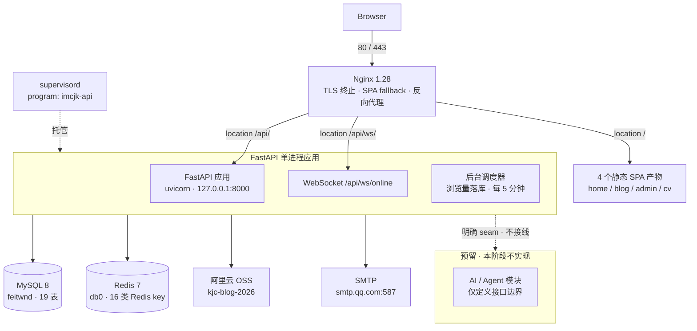
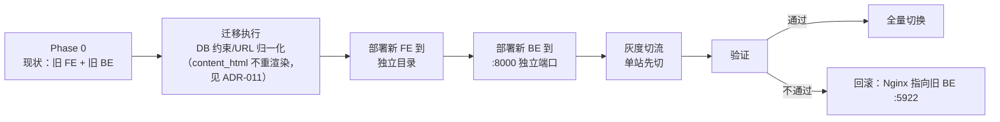

# TECHNICAL_ARCHITECTURE — IMCJK 新站总体技术架构设计

> **阶段**：Phase 1（总体技术架构设计）
> **项目**：imcjk.top 原站重构（Java / Spring Boot → Python / FastAPI）
> **依据文件（唯一业务事实来源）**：
> - `imcjk-backup/BACKUP_MANIFEST.md`（服务器 / 数据库 / 部署事实）
> - `IMCJK_ANALYSIS.md`（原系统前后端与业务全景图）
> - `imcjk-backup/OSS_BACKUP_MANIFEST.md`（OSS 对象事实）
> - 交叉核对：`analysis/api-inventory.md`、`analysis/db-analysis.md`、`analysis/mapper-analysis.md`、`analysis/crosscheck.md`
> - **Phase 1 收尾新增的事实文件**：`analysis/R1-markdown-rendering.md`（渲染链路）、`analysis/R2-password-hash.md`（密码算法）
>
> **本阶段不写业务代码、不改旧系统、不改服务器、不迁移数据、不部署。**
> 本文所有结论均可回溯到上述文件。

---

## 0. 阅读指引与事实等级

### 0.1 四类标记（贯穿全文）

| 标记 | 含义 | 判定标准 |
|---|---|---|
| **【FACT】** | 旧系统事实 | 可由备份中的代码 / 配置 / dump / SQL 直接证明，附来源 |
| **【INFERENCE】** | 由多条事实推导 | 附依据，但无法 100% 从代码确认 |
| **【DECISION】** | 新系统设计决定 | 本阶段做出的选择，附理由与被否方案 |
| **【UNKNOWN】** | 当前资料无法确定 | 明确说明缺什么证据 |

> ⚠️ **严禁混用**：【FACT】是"旧系统长什么样"，【DECISION】是"新系统打算怎么做"。
> 两者在文中用不同小节物理隔离，并在 §15 汇总"需要人工决策"的部分。

### 0.2 本设计使用的方法论 Skill

| Skill | 用途 | 边界 |
|---|---|---|
| `codebase-design` | 以"**深模块**（小接口 + 大量行为）"原则划分后端模块，用 **seam** 语言描述边界 | 仅提供**设计语言**，不提供业务事实 |
| `domain-modeling` | 建立术语表 [`docs/GLOSSARY.md`](docs/GLOSSARY.md)、按 ADR 格式记录关键决策（`docs/adr/`） | 同上 |

> **红线**：Skill 的"最佳实践"**不得覆盖**项目实际需求。
> 凡涉及旧系统的结论，一律回到 §2 / §14 的备份证据；Skill 只影响"如何组织"，不影响"保留什么"。

### 0.3 旧系统的三个硬性事实（决定了本次架构的自由度）

1. **前端源码已丢失** —— 服务器上只有 `dist` 产物（【FACT】，`BACKUP_MANIFEST.md` §2）。前端**必须重写**，路径与响应结构可以重新设计，但**对外契约不能断**。
2. **数据库语法兼容** —— 旧的 `feitwnd` 库是标准 MySQL 8（【FACT】）。（**证据**：`analysis/db-analysis.md` 全部为常规 InnoDB 2 表定义，无特殊语法）→ **新后端可以直接复用同一份数据**，这是"可回滚"的前提。
3. **数据量极小** —— 全库 1.25 MB / 19 表（【FACT】）。（**证据**：`analysis/db-analysis.md` 行数总表）→ **任何"迁移成本"都不构成架构约束**；架构选择应优先考虑**正确性**与**可回滚性**，而不是吞吐。

### 0.4 已知分析局限（继承自 `IMCJK_ANALYSIS.md` §0）

- 前端组件名、变量名、注释在 Vite 压缩后**全部丢失**；界面细节（表单字段、`v-if` 分支）**不可读**。
- 反编译丢失局部变量名，参数语义名以注解中显式书写者为准。
- 旧 OSS 桶的"代码定义"与"实际对象"是两件事，已在 §8 分开陈述。

---

## 1. 技术方案目标

### 1.1 目标（必须达成）

| # | 目标 | 验收方式 |
|---|---|---|
| G1 | **功能等价** —— 旧站已存在的业务功能一个不少 | 对照 §14.2 功能清单逐项勾选（Phase 2 前建立） |
| G2 | **对外契约不断** —— slug 路由、RSS、Sitemap、`/api` 前缀、响应结构、分页结构、WebSocket 路径 | §14.3 契约清单 |
| G3 | **历史数据零丢失** —— 19 表全部数据 + OSS 107 对象 | §13 迁移策略 + 迁移前后行数/校验和比对 |
| G4 | **可回滚** —— 出问题时能切回旧系统 | §13.3 切回方案（不依赖数据库回退） |
| G5 | **适配服务器真实资源** —— 2 vCPU / 1.6 GB RAM / 40 GB | §12 资源预算 |
| G6 | **技术栈对齐** —— Vue 3 + Vite + TS / FastAPI + SQLAlchemy 2.x + Pydantic | ADR-001 / ADR-002 / ADR-003 |

### 1.2 非目标（明确不做）

| 不做 | 理由 |
|---|---|
| ❌ 新增业务功能 | 本次是"换语言重构"，不是产品重设计 |
| ❌ 引入 AI / Agent / RAG / 向量库 / LangGraph | 旧系统无此业务需求（【FACT】：119 端点中无任何 AI 相关端点）。**仅预留边界**，见 §11 与 ADR-008 |
| ❌ 引入 Kafka / RabbitMQ / Elasticsearch / K8s / 微服务 | 服务器仅 1.6 GB RAM（【FACT】），且数据量 1.25 MB，纯属自增复杂度 |
| ❌ 引入独立 API Gateway | Nginx 已足够承担反向代理与 TLS 终止 |
| ❌ 分库分表 / 读写分离 | 数据量不需要 |
| ❌ 改动 OSS 桶内容 / 数据库数据 | 本阶段与迁移前的所有阶段均为只读 |
| ❌ 修改生产服务器 | 部署与切换属后续阶段 |

### 1.3 架构优先级排序（用于裁决冲突）

```
正确性  >  可回滚性  >  简单性  >  开发体验  >  性能
```

> **依据**：数据量 1.25 MB、QPS 极低（个人站点），**性能不是本次架构的约束**。
> 真正的风险在"数据搬错、功能漏掉、回不去"，因此排序如上。

---

## 2. 旧系统事实摘要（FACT 区）

> 本节**只陈述事实**，不含任何新系统设计。每条均可回溯到来源文件。

### 2.1 技术栈与规模

| 项 | 值 | 来源 |
|---|---|---|
| 后端框架 | Spring Boot **3.5.7**，应用名 `KangBlogBackend`，端口 **5922** | `IMCJK_ANALYSIS.md` §1 |
| 构建 JDK / 字节码 | 构建 JDK **21** / 字节码 **Java 21**（class 文件 major = 0x41 = 65） | `IMCJK_ANALYSIS.md` §1（**已更正**，见下方注） |
| 工程结构 | 多模块 Maven：`FeiTwnd-server`（144 类）+ `FeiTwnd-pojo`（80 类）+ `FeiTwnd-common`（39 类） | 同上 |
| 持久层 | MyBatis（`mapper-locations: classpath:mapper/*.xml`） | 同上 |
| 连接池 | Alibaba Druid（initial 5 / min-idle 5 / max-active 20 / max-wait 60s） | 同上 |
| 虚拟线程 | **开启**（`spring.threads.virtual.enabled: true`） | 同上 |
| 数据库 | MySQL **8.0.45**，库 `feitwnd`，InnoDB / `utf8mb4_0900_ai_ci` | `BACKUP_MANIFEST.md` §4 |
| 缓存 | Redis **7.2.12**，`127.0.0.1:6379` / **db0** | `IMCJK_ANALYSIS.md` §8 |
| 对象存储 | 阿里云 OSS，`oss-cn-beijing`，bucket `kjc-blog-2026` | `OSS_BACKUP_MANIFEST.md` §1 |
| 邮件 | SMTP `smtp.qq.com:587` | `BACKUP_MANIFEST.md` §3 |
| Web 服务器 | Nginx **1.28.0**（宝塔编译版） | 同上 |
| 进程托管 | **supervisord**（program 名 `home-java`），**非 systemd** | `BACKUP_MANIFEST.md` §6 |
| 面板 | 宝塔 v11.6.0（端口 21641） | `BACKUP_MANIFEST.md` §1 |
| 服务器 | 2 vCPU / **1.6 GB RAM** / 40 GB 磁盘（已用 12 GB） | 同上 |
| Docker | 已安装 29.3.0，**0 容器** | `BACKUP_MANIFEST.md` §3 |
| PHP | 8.2.28 运行中，**站点未使用** | 同上 |
| 后端内存参数 | `-Xms256m -Xmx512m` | `BACKUP_MANIFEST.md` §6 |

> **【更正说明】字节码版本**：原分析记为"字节码 Java 17"，与同一行给出的证据
> `cafe babe 0000 0041` **自相矛盾** —— `0x0041 = 65 = Java 21`（Java 17 应为 `0x3d = 61`）。
> 已于 2026-10-03 用 `od` 复核 `FeiTwnd-common` / `FeiTwnd-server` 多个 class 文件，**全部为 `00000041`**，
> 且 JDK 17 的 `javac` 会报 *"类文件具有错误的版本 65.0, 应为 61.0"* → **确认旧系统字节码为 Java 21**。
> `IMCJK_ANALYSIS.md` §1 已同步更正。**对本次迁移无实质影响**（新系统为 Python），但需保证事实文件自洽。

### 2.2 端到端规模（全部为实测枚举，非估算）

| 维度 | 数量 | 来源 |
|---|---|---|
| Controller | **44** | `analysis/api-inventory.md` |
| HTTP 端点 | **119**（GET 57 / PUT 23 / POST 22 / DELETE 17） | `IMCJK_ANALYSIS.md` §4.1 |
| Service | 34 接口 + 34 实现 | 同上 §4.2 |
| MyBatis Mapper | **18**，共 **79** 条 SQL | `analysis/mapper-analysis.md` |
| Entity / DTO / VO | 19 / 36 / 25 | `IMCJK_ANALYSIS.md` §4.4 |
| Config 类 | 8 | 同上 §4.5 |
| Interceptor | **1**（`JwtTokenAdminInterceptor`），**无 Servlet Filter** | 同上 §4.6 |
| 自定义异常 | 23（全部继承 `BaseException`） | 同上 §4.7 |
| 全局异常处理分支 | 11 类 | 同上 §4.7 |
| 工具类 | 6（AliOss / ImageCompress / Jwt / Ip / Markdown / HttpClient） | 同上 §4.8 |
| AOP 切面 | 3（`@OperationLog` / `@AutoFill` / `@RateLimit`） | 同上 §4.9 |
| 定时任务 | **1**（`ViewCountSyncTask`，每 5 分钟） | 同上 §4.10 |
| WebSocket 端点 | **1**（`/ws/online`） | 同上 §4.10 |
| 数据库表 | **19**，**外键约束 0 个** | `analysis/db-analysis.md` |
| Redis Key 类别 | **12** | `IMCJK_ANALYSIS.md` §8 |
| 前端站点 | 4（129 文件 / 10,740,262 字节） | `BACKUP_MANIFEST.md` §8 |
| OSS 对象 | 107（72.61 MB） | `OSS_BACKUP_MANIFEST.md` §1 |

### 2.3 站点与路由

**【FACT】** 4 个域名共用**同一个后端** `127.0.0.1:5922`，仅 `server_name` 与 `root` 不同。

| 域名 | 标题 | 根目录 | 路由数 |
|---|---|---|---|
| `imcjk.top` + `www.` | Kang Home | `/www/wwwroot/imcjk.top` | 1（单页） |
| `admin.imcjk.top` + `www.` | Kang Admin | `/www/wwwroot/admin.imcjk.top` | **17**（含 `/` 与 404 兜底） |
| `blog.imcjk.top` + `www.` | kang's blog | `/www/wwwroot/blog.imcjk.top` | **9**（+ 404 兜底） |
| `cv.imcjk.top` + `www.` | Kang CV | `/www/wwwroot/cv.imcjk.top` | 1（单页） |

**前端页面清单（从路由表反推，来源 `IMCJK_ANALYSIS.md` §3.2）**：
- admin：`/login`、`/dashboard`、`/article/list`、`/article/edit`、`/article/edit/:id`、`/category`、`/comment`、`/friend-link`、`/message`、`/music`、`/operation-log`、`/profile`、`/rss`、`/settings`、`/view-record`、`/visitor`
- blog：`/`、`/article/:slug`、`/category/:slug`、`/tag/:slug`、`/archive`、`/about`、`/links`、`/message`、`/403`

> ⚠️ 注意 admin 路由表**没有**独立的 `/tag` 路由，但存在完整标签接口与表 → 标签管理可能合并在 `/category` 页（**【UNKNOWN】**，见 §15）。

### 2.4 前后端契约（旧系统事实）

| 契约 | 事实 |
|---|---|
| 前端 baseURL | **4 站全部** 为 `"/api"` |
| Nginx 行为 | `location /api/ { proxy_pass http://127.0.0.1:5922/; }` —— **末尾斜杠剥离 `/api` 前缀** |
| WebSocket | 仅 blog：`/api/ws/` → `127.0.0.1:5922/ws/` |
| 统一响应 | `Result<T>` = `{ code, msg, data }`，**成功 `code = 1`**，失败 `code = 0` |
| 分页结构 | `PageResult` = `{ total, records }` |
| 鉴权 header | `Authorization`（配置 `feitwnd.jwt.token-name`） |
| JWT | HS256，**TTL 2 小时**，claims = `adminId` / `adminRole`；Redis 维护 `token:active:{id}` 白名单（Set） |
| 鉴权范围 | 拦截器**只拦 `/admin/**`**，放行 `/admin/admin/{login,sendCode,logout}` |
| 公开组 | `/blog/**`、`/cv/**`、`/home/**` **完全不鉴权** |
| 交叉验证结果 | 前端 **123** 个调用 **100% 匹配**后端端点；0 死链路；9 个后端端点前端未用（其中 2 个由 `<link>` 触发） |

### 2.5 数据与业务机制（旧系统事实）

| 机制 | 事实 |
|---|---|
| 文章双存 | `articles.content_markdown`（longtext）+ `content_html`（longtext）**同时存储** |
| 文章路由键 | 用 **`slug`**（唯一键），非 id |
| 浏览量 | **Redis Hash `article:viewCount`**（field=文章 id）缓冲增量 → `ViewCountSyncTask` **每 5 分钟**（`fixedRate=300000`，`initialDelay=60000`）落回 `articles.view_count`；有分布式锁 `lock:viewCountSync`（SETNX，TTL 4 分钟） |
| 浏览量读取 | 详情接口返回时 = DB 值 + `HGET article:viewCount {id}` 增量（**两次相加**） |
| 访客识别 | **浏览器指纹**（`visitors.fingerprint` 唯一键）；`visitor:fingerprint:{fp}` 缓存 1 小时 |
| 评论/留言 | 结构一致（`root_id`/`parent_id` 评论树 + 6 个布尔标志），写入**无鉴权**，仅 `@RateLimit` + 指纹风控 |
| 密码 | **`SHA-256(password + salt)`**，单轮快速哈希 |
| 角色 | 两种：`role=1` 管理员 / `role=0` **只读游客（仅 GET）** |
| 游客登录 | `role=0` 时**跳过邮箱验证码**，直接比对配置中的**固定字符串** |
| 上传后处理 | 图片自动压缩为 WebP（质量 0.9、上限 500KB）；单文件 15MB / 请求 50MB |
| OSS 对象命名 | `{category}/{UUID}.{ext}`；**10 类目录**由 `getFileCategory(扩展名)` 生成 |
| OSS URL | 上传**返回完整绝对 URL** `https://kjc-blog-2026.oss-cn-beijing.aliyuncs.com/{category}/{UUID}.{ext}` |
| 数据库存 URL 方式 | **存完整绝对 URL**，非仅存 key |
| RSS / Sitemap | `GET /blog/rss`、`GET /blog/sitemap.xml`，`@Cacheable`，`produces=application/xml` |
| 在线人数 | `@ServerEndpoint("/ws/online")`，纯内存 `ConcurrentHashMap` + `AtomicInteger`，**无持久化**，重启归零 |
| 操作日志 | `@OperationLog` 切面 + 异步落库 `operation_logs` |
| 自动填充 | `@AutoFill` 切面填 `create_time` / `update_time` |
| 限流 | `@RateLimit(type, tokens, burstCapacity, timeWindow, message)`，Redis key 形如 `rate_limit:ip:{endpoint}:{ip}` |

### 2.6 关键版本号（**UNKNOWN** 项）

**【UNKNOWN】** 前端各库（Vue / Vite / Element Plus / ECharts / md-editor-v3 / Pinia / axios）的**精确版本号无法确定** —— 构建产物已剥离版本，服务器无源码工程、无 `package.json`。
→ **后果**：新前端不能"对齐旧版本"，只能按目标架构**重新选版**并在 Phase 2 记录锁定版本。

**【FACT·新增】前端 Markdown 编辑器已确认是 `md-editor-v3`**（R1 事实确认，见 `analysis/R1-markdown-rendering.md`）：

| 项 | 事实 | 证据 |
|---|---|---|
| 编辑器 | `md-editor-v3`（独立 chunk `md-editor-Dp5qtK6X.js`） | 产物中存在 `md-editor-v3` / `MdEditor` 标识 |
| 其渲染内核 | `markdown-it`（chunk 内可见 `markdown-it` + `codemirror`） | 同上 |
| 输出特征 | 标题带 `id`（= 标题文本）、元素带 `data-line`、段落内单换行 → `<br>`（`breaks:true`） | 19/19 篇文章的 `content_html` |
| 影响 | **前端编辑器行为是内容管线的对外契约的一部分**（见 ADR-011） | — |

---

## 3. 新系统总体架构图

**【DECISION】** 架构基调：**保持与旧系统同构的简单拓扑**，仅替换实现语言与技术栈。不引入任何新的基础设施组件。



### 3.1 与旧系统的架构对照

| 层次 | 旧系统【FACT】 | 新系统【DECISION】 | 变化 |
|---|---|---|---|
| TLS / 静态 / 反代 | Nginx 1.28 | **同一台 Nginx**（配置需调整，见 §12.3） | 配置级，不换组件 |
| 应用 | Spring Boot jar（supervisord `home-java`） | **FastAPI**（supervisord `imcjk-api`） | 换语言 |
| 应用并发模型 | 虚拟线程 | **asyncio**（uvicorn） | 换并发模型 |
| 数据库 | MySQL 8.0.45 | **同一个 MySQL 实例、同一个 `feitwnd` 库** | **不换库、不换数据** |
| 缓存 | Redis 7.2.12 db0 | 同一实例，**key 命名空间化** | 换 key 命名 |
| 对象存储 | OSS `kjc-blog-2026` | **同一个 bucket**（默认不迁移） | 见 ADR-006 |
| 邮件 | smtp.qq.com:587 | 同 | 不变 |
| 进程托管 | supervisord | **同一个 supervisord**（新增 program） | 复用 |
| 容器 | Docker 已装、0 容器 | **仍不使用 Docker** | 不引入 |

> **为什么保持同构**：服务器 1.6 GB RAM（【FACT】），增加组件即增加内存与运维风险；
> 且本重构的收益来自**语言与可维护性**，不来自拓扑变化。

---

## 4. Frontend Architecture

### 4.1 核心决策：**pnpm monorepo + 4 个独立构建产物**（见 ADR-003）

**【FACT】** 支撑该决策的旧系统事实：
1. 4 个站点共用**同名同 hash** 的 `assets/index-7JRY2_6_.css` → 【INFERENCE】来自同一套设计系统（置信度高）；
2. 4 站 baseURL 统一为 `/api`；
3. 4 站均用 Vue 3 + Vite + Element Plus + axios；
4. admin 有 17 条路由、blog 9 条、home/cv 各 1 条；
5. **前端源码已丢失**，必须重写。

**被比较的两个方案**：

| 维度 | 方案 A：4 个完全独立的仓库/工程 | 方案 B：合并为 1 个 SPA（路径前缀区分） | **方案 C（选中）：pnpm monorepo + 4 个 app** |
|---|---|---|---|
| 设计系统一致性 | ❌ 4 份样式会漂移 | ✅ 天然一致 | ✅ 共享 `@imcjk/ui` |
| 公开包体积 | ✅ 各站最小 | ❌ **admin 代码会进入公开构建图** | ✅ 各站最小 |
| 部署独立性 | ✅ 完全独立 | ❌ 一次发版影响全站 | ✅ 各站独立构建/发布 |
| 与现有域名契约 | ✅ 一致 | ❌ 破坏 4 子域结构 | ✅ 一致 |
| 鉴权模型隔离 | ✅ 隔离 | ⚠️ 同包内混用 token 与匿名逻辑 | ✅ 隔离 |
| 代码复用 | ❌ 三处重复 | ✅ | ✅ |
| 首次建设成本 | 低 | 中 | 中 |

**选择理由**（对应用户要求"必须分析两种方案优缺点后给出明确建议"）：
- 选 **C**，因为 A 放弃复用、B **把管理后台代码打进公开站点**（安全与体积双重退化）且破坏既有子域契约。
- C 同时拿到 A 的"部署隔离/包体积"与 B 的"复用/一致性"。
- **关键约束**：monorepo 只是**构建期**的组织方式，**运行时仍是 4 个独立 SPA、4 个独立 root、4 份独立产物**，对外表现与旧系统完全一致。

### 4.2 前端工程组织（【DECISION】）

```text
frontend/
├── pnpm-workspace.yaml
├── package.json
├── tsconfig.base.json
├── apps/
│   ├── home/          → imcjk.top        （1 条路由）
│   ├── blog/          → blog.imcjk.top   （9 条路由 + RSS/sitemap link）
│   ├── admin/         → admin.imcjk.top  （17 条路由）
│   └── cv/            → cv.imcjk.top     （1 条路由）
└── packages/
    ├── ui/            → 设计系统：基础样式 + 通用组件
    ├── api-client/    → 类型化 HTTP 客户端（axios 封装 + baseURL=/api）
    ├── types/         → 由后端 OpenAPI 生成的 TS 类型
    └── utils/         → 指纹、格式化、Markdown 预览等共享逻辑
```

**契约**：4 个 app 的 `baseURL` **必须**为 `/api`（【FACT】旧系统如此 + 【DECISION】新后端沿用该前缀，见 §10.1）。

### 4.3 页面与路由（【DECISION】：结构保留，命名保留）

| app | 路由 | 类型 |
|---|---|---|
| home | `/` | 单页（个人信息 + 社交链接） |
| cv | `/` | 单页（个人信息 + 技能 + 经历） |
| blog | `/`、`/article/:slug`、`/category/:slug`、`/tag/:slug`、`/archive`、`/about`、`/links`、`/message`、`/403`、404 兜底 | 保留旧路径与参数名 |
| admin | `/login`、`/dashboard`、`/article/list`、`/article/edit`、`/article/edit/:id`、`/category`、`/comment`、`/friend-link`、`/message`、`/music`、`/operation-log`、`/profile`、`/rss`、`/settings`、`/view-record`、`/visitor` | 保留旧路径 |

> **为什么保留旧路由字面量**：blog 的 `/article/:slug` 等路径**已对外收录/被引用**（【FACT】：RSS 中的 `url` 为 `/article/9-21`）→ 属于**对外契约**，不可改。
> admin 路由虽非外部契约，但保留可降低重写成本与漏功能风险。

**【DECISION·FROZEN（D4）】不新增业务页面**：标签管理页归属属【UNKNOWN】（旧系统无独立 `/tag` 路由）。
新系统**只保留**旧系统已有的 tag API / 数据 / 关系 / 查询能力，**不为补齐 REST 资源而新增前端页面或业务功能**（§15.1 D4）。

### 4.4 API Client 与类型系统（【DECISION】）

- **单一客户端**：`packages/api-client` 封装 axios，统一处理：
  - `baseURL = '/api'`
  - 响应解包：后端 `{ code, msg, data }`，**`code === 1` 视为成功**（【FACT】旧契约）
  - 错误映射：`code === 0` → 抛出携带 `msg` 的业务错误
  - 401 / token 失效 → admin app 跳转 `/login`
- **类型来源**：**由后端 OpenAPI schema 生成** TS 类型（`packages/types`）。
  - 理由：后端用 Pydantic 定义 schema，天然可导出 OpenAPI；前端类型与后端契约**同源**，杜绝手写漂移。
  - **替代方案（被否）**：手写 TS interface —— 会与后端漂移，且 119 端点规模下手写不现实。

### 4.5 状态管理（【DECISION】）

**【FACT】** 旧系统仅在 **admin** 使用 `localStorage`，键名 `admin_token`；blog/home/cv **无任何本地存储**，无登录态。

**【DECISION】**：
- 采用 **Pinia**（【FACT】旧产物中出现 `pinia` 字符串），但**只用于必要的跨组件状态**（如 admin 的当前用户、blog 的访客身份缓存）。
- admin token 存储位置：**沿用 `admin_token` 键名**（降低迁移成本），但抽象为 `packages/api-client` 的 token provider。
- ✅ **【DECISION】token 存储介质已冻结（2026-10-03）= 沿用 `localStorage`**（D2，见 ADR-003）。
  【FACT】旧行为：admin 用 `localStorage` 键 `admin_token` + 请求头 `Authorization`。
  **不切 HttpOnly Cookie** —— 切则引入 `Domain` / `SameSite` / CSRF / 跨子域 / `credentials` / CORS 等新变量，
  超出"Java → Python 功能等价迁移"的范围。**已知代价**：`localStorage` 易受 XSS 影响 → 作为**已知风险接受**，
  未来如做认证安全升级再单独立项（不在本重构内）。

### 4.6 权限（【DECISION】）

**【FACT】** 旧系统 admin 前端在 `localStorage` 存 `admin_token`，且后端对 `role=0` 只允许 GET。

**【DECISION】**：
- admin app 路由守卫：无 token → 跳 `/login`（【INFERENCE】旧系统行为，置信度中高）。
- **前端权限仅作 UX 优化**，真正边界在**后端**（游客只读由后端拦截器保证）。
- 【DECISION】后端应返回当前角色，前端据此**隐藏**写操作按钮（而非仅靠报错）。

### 4.7 构建与部署（【DECISION】）

| 项 | 决定 |
|---|---|
| 构建 | Vite，4 个 app 各自 `build`，产物 `dist/` |
| 产物形态 | 纯静态（js/css/字体/图片） |
| 部署目标 | 4 个独立 root，**继承** `/www/wwwroot/<site>/` 结构 |
| SPA fallback | 由 Nginx `try_files $uri $uri/ /index.html` 承担（同旧系统） |
| 字体/图标 | 【FACT】旧系统用 iconfont → 【DECISION】沿用或替换为本地图标，Phase 2 定 |
| 哈希命名 | Vite 默认 `[name]-[hash]`，保留（利于缓存失效） |

**【DECISION】样式共享**：【FACT】旧 4 站共用同一个 CSS 文件 → 新系统将该文件的内容**归入 `packages/ui`**，由 4 个 app 各自 import，构建期内联到各自产物（**运行时不再跨域共享 CSS**，因为旧系统其实也是各自目录下各有一份同名文件）。

---

## 5. Backend Architecture

### 5.1 核心决策：**按业务边界重划模块**，不做 Controller/Service/Mapper 的机械翻译（见 ADR-001）

**【FACT】** 旧系统存在的结构性问题（这是"不机械翻译"的依据）：

| 事实 | 问题 |
|---|---|
| 同一个业务名在 admin/blog/cv/home **各有一个 Controller**（如 4 个 `PersonalInfoController`） | 同一业务逻辑被切成 4 份，重复实现 |
| 60 个端点为"裸映射"（方法无路径，路径即类级 base） | 靠 HTTP 方法区分 CRUD，接口语义不清晰 |
| 命名不一致：`/admin/article/tag` vs `/admin/articleCategory` | 同类资源两种命名风格 |
| Service 层 34 接口 + 34 实现（接口与实现 1:1） | **Java 特有的注入惯性**，Python 无此必要 |

**【DECISION】**：新后端以 **"业务边界 → 模块 → API → 数据访问"** 的顺序重新组织。
使用 `codebase-design` 的**深模块**原则：每个模块对外是**小接口**（`router.py` + `service.py` 的少量函数），把 SQL、事务、外部集成全部隐藏在内部。

### 5.2 后端目录结构（【DECISION】）

```text
backend/
├── pyproject.toml
├── alembic.ini
├── .env.example                  ← 所有密钥走环境变量，禁止硬编码
├── app/
│   ├── main.py                   ← FastAPI 实例、中间件、路由挂载、生命周期
│   ├── core/
│   │   ├── config.py             ← Pydantic Settings（读环境变量）
│   │   ├── security.py           ← 密码哈希、JWT 签发/校验
│   │   ├── deps.py               ← 依赖注入：DB session / 当前用户 / 角色
│   │   ├── errors.py             ← 异常基类 + 全局异常处理器
│   │   └── logging.py            ← 日志配置
│   ├── db/
│   │   ├── session.py            ← async engine / sessionmaker
│   │   ├── base.py               ← DeclarativeBase
│   │   └── models/               ← SQLAlchemy 2.x ORM 模型（19 表）
│   ├── integrations/             ← 外部系统适配器（seam）
│   │   ├── oss.py                ← 上传 / URL 生成 / 分类
│   │   ├── smtp.py               ← 邮件发送
│   │   └── redis.py              ← Redis 客户端 + key 命名工具
│   ├── modules/                  ← 业务模块（见 5.3）
│   │   ├── auth/
│   │   ├── article/
│   │   ├── taxonomy/             ← 分类 + 标签
│   │   ├── comment/
│   │   ├── interaction/          ← 点赞 + 浏览记录
│   │   ├── visitor/
│   │   ├── message/
│   │   ├── music/
│   │   ├── link/
│   │   ├── rss/
│   │   ├── site_content/         ← 个人信息 / 技能 / 经历 / 社交
│   │   ├── config/
│   │   ├── report/
│   │   └── upload/
│   ├── tasks/
│   │   └── scheduler.py          ← APScheduler：浏览量落库（替代 @Scheduled）
│   ├── ws/
│   │   └── online.py             ← WebSocket 在线人数
│   └── ai/                       ← 【预留】Phase 1 只放接口定义，无实现
├── migrations/                   ← Alembic
└── tests/
```

### 5.3 模块内部结构（每个模块统一 5 个文件）

```text
modules/<name>/
├── router.py       ← 接口层：路径 / 方法 / 依赖注入 / 状态码（= 深模块的"小接口"）
├── schemas.py      ← Pydantic 入参 DTO + 出参 VO（= 契约定义，导出 OpenAPI）
├── service.py      ← 领域逻辑：业务规则、事务边界、跨模块编排（= 深模块的"行为"）
├── repository.py   ← 数据访问：SQL / ORM 查询，只被 service 调用
└── models.py       ← 该模块相关表的 SQLAlchemy 模型（或引用 db/models）
```

**为什么这样分层**（`codebase-design` 的 depth 判据）：

| 层 | 职责 | 为什么放在这里 |
|---|---|---|
| `router.py` | HTTP 语义映射 | 是**唯一的外部 seam**：测试可以直接 `TestClient` 打接口，不必穿透 |
| `service.py` | 业务规则 + 事务 | **深模块核心**：例如"发布文章"要同时写 articles、tag_relations、重建 content_html、更新计数 —— 对调用方只是一个 `publish(article_id)` |
| `repository.py` | 数据访问 | 让 SQL 有**唯一落点**（locality）：改一处，全模块生效 |
| `schemas.py` | 契约 | 与后端 OpenAPI 同源，前端类型由此生成 |

**明确不做的**：
- ❌ 不建 `service_map.py` 式的注册中心；
- ❌ 不引入 Repository 接口 + 实现两套（【FACT】旧系统 34 接口/34 实现是 Java 注入惯性；Python 用**函数 + 依赖注入**即可）；
- ❌ 不为每个模块建 `exception.py`（统一放 `core/errors.py`）。

### 5.4 旧职责 → 新落点映射（【DECISION】）

| 旧系统【FACT】 | 新系统落点【DECISION】 | 说明 |
|---|---|---|
| 44 个 Controller | **14 个模块的 `router.py`**（见 §5.5 清单） | 按业务聚合，不再按站点重复 |
| 34 接口 + 34 实现 | `service.py` 中的**函数** | 去掉 1:1 接口层 |
| 18 个 Mapper + **145 条 SQL**（XML 79 + 注解 66） | `repository.py`（SQLAlchemy 2.x） | SQL 集中；复杂聚合查询保留手写 SQL。⚠️ **Phase 2 修正**：Phase 1 的"79 条"仅 XML，见 `API_AND_DATA_DESIGN.md` §8.2 |
| 19 个 Entity | `db/models/`（19 个 ORM 模型） | **一一对应**（【FACT】实体与表 1:1） |
| 36 个 DTO | `schemas.py` 的 `*In` / `*Query` | Pydantic v2 |
| 25 个 VO | `schemas.py` 的 `*Out` | Pydantic v2，`from_attributes=True` |
| `JwtTokenAdminInterceptor` | `core/deps.py` 的 `Depends(get_current_admin)` | FastAPI 依赖注入替代拦截器 |
| `BaseContext`（ThreadLocal） | 依赖注入参数（`current_admin`） | asyncio 无 ThreadLocal，改用显式传参 |
| `GlobalExceptionHandler`（11 类） | `core/errors.py` + `@app.exception_handler` | 保留**响应形状**（`{code,msg,data}`） |
| `@OperationLog` 切面 | 装饰器 / 中间件 + `BackgroundTasks` | 见 ADR-001 "Consequences" |
| `@AutoFill` 切面 | SQLAlchemy 事件钩子（`before_insert` / `before_update`） | 不散落到各 service |
| `@RateLimit` 切面 | FastAPI 依赖（`Depends(rate_limit(...))`） | 保留 Redis 令牌桶语义 |
| `@Cacheable`（RSS / Sitemap） | 显式 Redis 缓存（`integrations/redis.py`） | 去掉隐式魔法 |
| `@Scheduled` | `tasks/scheduler.py`（APScheduler） | **保留 `lock:viewCountSync` 分布式锁语义** |
| `@ServerEndpoint` | FastAPI WebSocket 路由 | 保留 `/api/ws/online` 路径 |
| 6 个工具类 | `integrations/` + `core/utils/` | OSS / 邮件 → `integrations`；图片压缩 → utils |

### 5.5 模块清单与职责（【DECISION】）

> 模块划分**依据**：19 张表 + 旧系统端点分组 + 数据分析中已验证的业务链路（`IMCJK_ANALYSIS.md` §11）。

| 模块 | 职责 | 涉及表 | 对应旧端点（示例） |
|---|---|---|---|
| `auth` | 管理员登录、邮箱验证码、登出、改密/昵称/邮箱、图形验证码 | `admin` | `/admin/admin/*`、`/blog/common/captcha/generate` |
| `article` | 文章 CRUD、发布、置顶、归档、搜索、slug 详情、浏览量 | `articles` | `/admin/article/*`、`/blog/article/*` |
| `taxonomy` | 分类 + 标签 + 文章-标签关系 | `article_categories`、`article_tags`、`article_tag_relations` | `/admin/articleCategory`、`/admin/article/tag`、`/blog/articleCategory`、`/blog/article/tag` |
| `comment` | 文章评论（树形、审核、管理员回复、编辑） | `article_comments` | `/admin/article/comment/*`、`/blog/articleComment/*` |
| `interaction` | 点赞 + 浏览记录 | `article_likes`、`views` | `/blog/articleLike/*`、`/admin/view/*` |
| `visitor` | 访客记录、指纹、IP 归属、风控（限流 + 封禁）、分页、封禁管理 | `visitors` | `/home|blog|cv/visitor/record`、`/admin/visitor/*` |
| `message` | 留言板（树形、审核、管理员回复） | `messages` | `/blog/message/*`、`/admin/message/*` |
| `music` | 音乐列表与管理 | `music` | `/blog/music`、`/admin/music/*` |
| `link` | 友链 | `friend_links` | `/blog/friendLink`、`/admin/friendLink/*` |
| `rss` | RSS 输出、Sitemap、订阅/退订/查询 | `rss_subscriptions`、`articles` | `/blog/rss`、`/blog/sitemap.xml`、`/blog/rssSubscription/*` |
| `site_content` | 个人信息、技能、经历、社交链接（**一份数据，多站投影**） | `personal_info`、`skills`、`experiences`、`social_media` | `/home/*`、`/cv/*`、`/blog/personalInfo`、`/admin/{personalInfo,skill,experience,socialMedia}/*` |
| `config` | 系统配置 key-value | `system_config` | `/home|blog/systemConfig/key/{key}`、`/admin/systemConfig/*` |
| `report` | 后台报表聚合（总览 / Top10 / 趋势 / 省份分布） | `views`、`visitors`、`articles` | `/admin/report/*`、`/blog/report` |
| `upload` | 文件上传（校验 → 压缩 → OSS）、操作日志分页/删除 | —（`operation_logs`） | `/admin/common/upload`、`/admin/operationLog/*` |

**关键简化（【DECISION】）**：`site_content` 用**一个 service** 支撑 4 个站的投影。
- 【FACT】依据：`home/socialMedia` 返回"仅可见项"（`getSocialVisibleMedia`），admin 返回全部（`getAllSocialMedia`）。
- 因此差异只是**可见性过滤 + 字段裁剪**，不是 4 套逻辑。
- 接口示例：`list_social_media(*, visible_only: bool)`；router 层为每个站点挂载各自的路径与投影。
- 这是**深模块**的典型收益：行为集中（1 处），接口很小，4 个调用点受益。

### 5.6 横切关注点（【DECISION】）

| 关注点 | 落点 | 关键约束 |
|---|---|---|
| 配置 | `core/config.py`（Pydantic Settings） | 全部密钥来自**环境变量**；`.env` 不进版本库 |
| 鉴权 | `core/deps.py` | 保留"`/admin/**` 需 token、`/blog|cv|home/**` 公开"的**旧行为** |
| 事务 | `db/session.py` + service 层显式 `async with session.begin()` | 事务边界在 **service**，不在 router |
| 异常 | `core/errors.py` | **响应形状必须保持** `{code, msg, data}` 与 `code=1` 语义 |
| 限流 | 依赖 + Redis 令牌桶 | 保留旧参数语义（tokens / burstCapacity / timeWindow） |
| 操作日志 | 装饰器 + `BackgroundTasks` | 异步落 `operation_logs`，不阻塞响应 |
| 后台任务 | `tasks/scheduler.py` | **必须持有 Redis 锁**（单 worker 下不冲突，但锁是提升 worker 数时的唯一保障） |
| WebSocket | `ws/online.py` | 路径 `/api/ws/online`；纯内存计数 |
| 日志 | `core/logging.py` | **生产必须 INFO**，禁止旧系统的 `mapper: debug`（【FACT】旧系统 SQL 全打） |

---

## 6. Database Architecture

### 6.1 核心决策：**同一实例、同一库、以"加约束"为主的渐进式变更**（见 ADR-004）

**【FACT】** 旧库现状：
- 19 表 / **0 外键** / InnoDB / `utf8mb4_0900_ai_ci`
- 表关系**完全由应用层维护**，但**每条关系都有 SQL 或索引证据**（见 6.3）
- 数据总量约 1.25 MB

**【DECISION】** 三条原则：
1. **不新建数据库、不重命名表、不重命名列** —— 保证新后端能直接读旧数据，且旧后端在回滚后仍可用。
2. **只做"加法"** —— 加外键、加少量标记列；不做破坏性改名或类型变更。
3. **列语义保持一致** —— 例如 `content_markdown` 仍是唯一内容源，不改名。

### 6.2 19 张表的处理方式（【DECISION】）

| 表 | 行数【FACT】 | 处理 | 说明 |
|---|---|---|---|
| `admin` | 1 | 原样 + **新增 1 列** | 加 `password_algo` 标记哈希算法，支持登录时渐进升级（§9.3） |
| `articles` | 19 | 原样 | `content_html` **原样保留、不重渲染**（ADR-011 / **D11**）；`cover_image` 按 §8.4 处理 |
| `article_categories` | 3 | 原样 | — |
| `article_tags` | 2 | 原样 | — |
| `article_tag_relations` | 24 | 原样 + **加外键** | `article_id` → `articles.id`（CASCADE）、`tag_id` → `article_tags.id`（CASCADE） |
| `article_comments` | 1 | 原样 + **加外键** | `article_id` → `articles.id`（CASCADE）；**自关联不加 FK**（见 6.5） |
| `article_likes` | 2 | 原样 + **加外键** | `article_id` → `articles.id`、`visitor_id` → `visitors.id`（均 CASCADE） |
| `visitors` | 169 | 原样 | `fingerprint` 唯一键保留；指纹策略见 §15 |
| `views` | 664 | 原样 + **加外键** | `visitor_id` → `visitors.id`（**SET NULL**，见 6.5） |
| `messages` | 0 | 原样 | 自关联不加 FK（同评论） |
| `music` | 3 | 原样 | — |
| `friend_links` | 0 | 原样 | — |
| `personal_info` | 1 | 原样 | — |
| `skills` | 1 | 原样 | — |
| `experiences` | 1 | 原样 | — |
| `social_media` | 3 | 原样 | — |
| `system_config` | 3 | 原样 | key-value；【FACT】前端有按 `key` 取配置的接口 |
| `rss_subscriptions` | 0 | 原样 + **加外键** | `visitor_id` → `visitors.id`（CASCADE） |
| `operation_logs` | 88 | 原样 | 审计表；`admin_id` **不加 FK**（见 6.5） |

### 6.3 表关系与证据（严禁仅凭字段名推断）

**【FACT】** 以下关系**不是**从列名猜测，每条都有 SQL / 索引证据（来源 `analysis/mapper-analysis.md`、`analysis/db-analysis.md`）：

| 关系 | 证据类型 | 证据内容 |
|---|---|---|
| `article_comments.article_id` → `articles.id` | **JOIN** | `left join articles a on c.article_id = a.id` |
| `article_tag_relations.article_id` → `articles.id` | **JOIN** | `left join articles a on atr.article_id = a.id and a.is_published = 1` |
| `articles.category_id` → `article_categories.id` | **JOIN** | `pageQuery` 中 `articles` 与 `article_categories` 联表取 `ac.name as category_name` |
| `article_comments.parent_id` / `root_id` → `article_comments.id` | **索引 + VO** | `idx_parent`、`idx_root` + `ArticleCommentVO` 树形结构 |
| `article_comments.visitor_id` / `messages.visitor_id` → `visitors.id` | **索引 + 业务** | `idx_fingerprint(visitor_id)`（评论表） |
| `article_likes.article_id` + `visitor_id` | **唯一键** | `uk_article_visitor` —— 明确用于"防重复点赞" |
| `views.visitor_id` / `views.article_id` | **SQL** | `ViewMapper.xml`（详情见 §2.5 浏览量机制） |
| `rss_subscriptions.visitor_id` → `visitors.id` | **索引** | `idx_visitor_id` |

> ⚠️ 【UNKNOWN】`article_likes` **无 `article_id` 的外键证据强度低于其他**（未发现 JOIN，仅唯一键命名）。
> 但**唯一键 `uk_article_visitor` 的语义**（一条记录 = 某访客对某文章的一次赞）已足以支撑"`article_id` 指向文章"。
> 若要 100% 确认，需读取 `ArticleLikeMapper` 的查询语句全文 → 属于 **Phase 2 待补证据**。

### 6.4 `content_html` 的处理（【DECISION】**已于 2026-10-03 修正**，见 `docs/adr/ADR-011-content-html-pipeline.md`）

> ⚠️ **本小节的原决策（"迁移时用新渲染器全量重新生成 `content_html`"）已被 R1 事实确认推翻并撤销。**
> R1 证明：**19/19 篇文章的 `content_html` 并非服务端渲染，而是前端 `md-editor-v3`（markdown-it）产出**，
> 证据是全部含 `data-line=` 属性（jsoup 白名单**不可能**保留）、标题带 `id`、段落内单换行渲染为 `<br>`（共 119 处）。
> 若按原决策重生成，会引入**两处可见回归**：段落内换行塌陷、标题锚点从"标题文本"变为"序号"。
> 完整证据链见 `analysis/R1-markdown-rendering.md`；决策依据见 **ADR-011**。

**【FACT】双渲染器并存的现状**：

| 载体 | 实际渲染者 | 后端处理 | 数据量 |
|---|---|---|---|
| `articles.content_html` | **前端** `md-editor-v3`（markdown-it） | **直通入库、不清洗**（`contentHtml` 非空时） | 19 篇 |
| `article_comments.content_html` | **服务端** `MarkdownUtil.toHtml` | 一律服务端渲染 | 1 条 |
| `messages.content_html` | 同上 | 同上 | **0 条**（空表） |

**【DECISION】新系统行为（ADR-011）**：

| 项 | 决定 |
|---|---|
| 存量 19 篇 `content_html` | **原样保留，不重渲染、不清洗、不归一化** |
| 新增/编辑文章 | **复现旧语义**：请求带非空 `contentHtml` → **直通入库**；为空 → 回退服务端渲染器 |
| 评论 / 留言 | **一律服务端渲染** |
| 前端 | **继续用 `md-editor-v3`** 并继续提交 `contentHtml`（见 ADR-003） |
| 服务端渲染器 | 必须等价 **commonmark-java 0.21.0 核心 + jsoup 1.16.1 `Safelist.relaxed()`** |
| 等价判据 | `tools/r1-golden/golden.tsv` 的 **62 条黄金样本逐条一致**（19 条为硬性要求） |
| 内容源 | 仍然：**`content_markdown` 是唯一真实资产**（【FACT】） |

**【FACT】服务端渲染器的完整规则**（字节码 + 黄金样本双证，详见 R1 报告 §1）：

```text
Parser.builder().build()            ← 无任何 .extensions(...)：表格/删除线/任务列表/裸URL 均不生效
HtmlRenderer.builder().build()      ← 默认配置
→ Jsoup.clean(html, Safelist.relaxed()
        .addTags("code","pre","hr")
        .addAttributes("code","class")
        .addProtocols("a","href","http","https","mailto")
        .addAttributes("a","target","rel")
        .addEnforcedAttribute("a","rel","nofollow noopener noreferrer"))
```

**【FACT】依赖版本**（`analysis/backend-app/BOOT-INF/classpath.idx` 第 37–42 行）：
`commonmark-0.21.0`（核心）、`commonmark-ext-gfm-tables-0.21.0`、`commonmark-ext-autolink-0.21.0`、
`commonmark-ext-task-list-items-0.21.0`、`jsoup-1.16.1`。
**注意**：三个扩展 jar **在依赖里但未被注册**（`MarkdownUtil` 只调 `builder().build()`）→ 属"存在但未使用"的依赖。

**风险与缓解（更新）**

| 风险 | 状态 |
|---|---|
| ~~旧 `MarkdownUtil` 的库与规则未分析~~ | ✅ **已解决**（R1 关闭） |
| 新渲染器与旧行为不等价 | 缓解：**62 条黄金样本回归夹具**，逐条 diff |
| 安全：文章直通分支不清洗 | ✅ **D10 FROZEN = 保留旧行为**（不清洗；安全改造另开任务） |
| 存量 19 篇是否纳入清洗 | ✅ **D11 FROZEN = 不清洗**（原样复制） |
| `word_count` / `reading_time` 口径 | 见 R1 报告 §5.5：中文字数按 Java `UnicodeScript.HAN` 计，范围宽于 `[\u4e00-\u9fff]`，**不可用通用近似** |

### 6.5 外键策略（【DECISION】）

**【FACT】** 旧库 0 外键，且分析已指出风险：`articles` 批量删除会留下**孤儿评论/点赞/浏览**（`IMCJK_ANALYSIS.md` §15.2 A1）。

**【DECISION】** 加外键，但**按语义选择 `ON DELETE` 行为**：

| 关系 | `ON DELETE` | 理由 |
|---|---|---|
| 评论 / 标签关系 / 点赞 → 文章 | **CASCADE** | 这些是文章的从属数据，文章删除后无独立意义；**正好修复旧系统的孤儿问题** |
| `views.visitor_id` → `visitors.id` | **SET NULL** | 【FACT】`views.visitor_id` 本身 `DEFAULT NULL`；浏览历史是**统计资产**，不应因访客记录清理而丢失 |
| `rss_subscriptions.visitor_id` → `visitors.id` | **CASCADE** | 订阅依赖订阅者身份 |
| `article_comments.parent_id` / `root_id`（自关联） | **不加 FK** | 树形结构的级联删除语义复杂（删父评论是否删子评论属于**产品决策**）；加错会误删数据 → 保持应用层控制 |
| `operation_logs.admin_id` | **不加 FK** | 【FACT】审计表 `admin_id` 可空，且审计记录应**独立于主体存在** |
| `articles.category_id` → `article_categories.id` | **SET NULL** | 【FACT】该列本身可空；删分类不应删文章 |

**【DECISION·FROZEN（D8）】加 FK 的前置条件**：迁移前必须先跑**孤儿数据检测**（只读）。
若发现孤儿（如 `article_comments.article_id` 指向不存在的文章）→ **检测 → 报告 → 暂不删除**；
**加外键仅在检测确认关系后进行**（禁止发现孤儿即删、禁止仅凭"无 FK"自行加 FK）。

### 6.6 索引（【DECISION】）

**【FACT】** 现有索引（节选，完整见 `analysis/db-analysis.md`）：

| 表 | 索引 |
|---|---|
| `articles` | `UNIQUE slug`、`idx_published_time`、`idx_publish_date`、`idx_category_status`、`idx_slug`、`idx_view_count` |
| `article_comments` | `idx_article_status`、`idx_parent`、`idx_root`、`idx_approved`、`idx_fingerprint` |
| `views` | `idx_view_time`、`idx_visitor_time`、`idx_page_date(page_path(50), view_time)` |
| `visitors` | `UNIQUE uk_visitor_fingerprint`、`idx_session_id`、`idx_last_visit` |
| `operation_logs` | `idx_admin_time`、`idx_type_time` |
| `article_likes` | `UNIQUE uk_article_visitor`、`idx_article` |
| `article_tag_relations` | `UNIQUE uk_article_tag`、`idx_tag_id` |
| `music` | `idx_sort_visible` |

**【DECISION】**：
1. **全部保留** —— 这些索引与已验证的查询模式（分页、归档、报表聚合）对应，且数据量小、维护成本可忽略。
2. **外键自动带索引**，但 `article_comments.article_id` 已有 `idx_article_status` 覆盖（首列即 `article_id`）→ **不重复建单列索引**（避免冗余）。
3. **新增索引：暂不新增**。理由：数据量 1.25 MB，任何查询都不会成为瓶颈；过早加索引属于无依据优化。
4. **`articles` 冗余列**：`publish_year` / `publish_month` / `publish_day` / `publish_date` 可由 `publish_time` 派生（【INFERENCE】）。
   - **DECISION：保留**（不删）。因为它们已被索引 `idx_publish_date` 使用，删除会牵动查询；且"减少冗余"不是本次目标。

### 6.7 事务（【DECISION】）

- SQLAlchemy 2.x async session，**每请求一个 session**（依赖注入）。
- **事务边界在 service 层**：如"创建文章" = 写 `articles` + 写 `article_tag_relations` + 生成 `content_html`，必须原子。
- 【FACT】旧系统使用 `@EnableTransactionManagement`（声明式事务）→ 新系统用**显式事务块**，边界更可见、更易测。

### 6.8 数据迁移策略（【DECISION】，仅设计，**本阶段不执行**）

| 步骤 | 内容 | 风险控制 |
|---|---|---|
| 0 | **全量备份**（已有 `database/feitwnd-20261003-120657.sql.gz`）+ 迁移前**再取一次** | 两份 dump 互校 |
| 1 | **孤儿检测** —— 按 §6.3 的 8 组关系逐条扫描 | 有孤儿则暂停，人工裁决 |
| 2 | **浏览量合并** —— 读取 Redis `article:viewCount` 全部 field，`HINCRBY` 计入 `articles.view_count`，再清理 Hash | 【FACT】必须做，否则丢最近 5 分钟增量 |
| 3 | Schema 变更（Alembic）：`admin.password_algo` + 外键约束（**先校验后加**） | 变更可回滚（Alembic downgrade） |
| 4 | `content_html` **原样保留（19 篇零改动）** | 逐字节 diff 确认零改动 + 62 条黄金样本回归 |
| 5 | URL 归一化（§8.4） | 先 dry-run 输出替换清单，人工确认后执行 |
| 6 | 行数 / 校验比对（迁移前后逐表对账） | 19 表全对 |
| 7 | 应用切换（§13.3） | 保留旧后端可回滚 |

> **【DECISION】迁移方式选择：原地演进（in-place）而非"新建干净库"**。
> 理由：① 数据量小，无性能动机；② 新后端直接读旧库 → **回滚只需切 Nginx**，不必回滚数据；③ 避免"数据双写"这类高复杂度方案（服务器仅 1.6 GB RAM）。

---

## 7. Redis Architecture

### 7.1 核心决策：**保留全部机制，重排命名空间**（见 ADR-005）

**【FACT】** Redis 配置（来源 `IMCJK_ANALYSIS.md` §8）：
- `host localhost / port 6379 / database 0`
- Key 序列化 `StringRedisSerializer`；**Value 序列化 `GenericJackson2JsonRedisSerializer`（value 存 JSON）**
- 另配 `CacheManager`（Spring Cache 抽象）

**【DECISION】**
1. **Key 命名空间化**：统一 `imcjk:` 前缀 + 域分段，避免与同实例其他应用冲突。
2. **Value 编码改为语言中立**：旧系统 value 是 **Java Jackson JSON**（带 `@class` 类型信息）。新系统用**纯 JSON**（`json.dumps`）→ **旧 Key 不做兼容**（不兼容），详见 7.4。
3. **保留全部 12 类机制**，不删任何一类。

> **【FACT·Phase 2 修订（2026-10-03）】口径精确化：`@RateLimit` 令牌桶不是 Redis key。**
> 经 Phase 2 读 `config/RateLimitConfiguration.java` + `classpath.idx` 确认：`@RateLimit` 的桶存在**进程内 `ConcurrentHashMap<String,Bucket>`**（bucket4j-core + bucket4j-jcache，**无 `bucket4j-redis`**）。
> → 因此 **Redis key 类别 = 16 类**（11 个显式 Redis key + 5 组 Spring Cache），而 **"机制" 仍是 12 类**（11 个 Redis 机制 + 1 个进程内限流机制）。
> → 两者**不矛盾**：**机制类别零增减**（§7.1 第 3 条成立），仅"Redis key 类别"的计数口径被精确化。详见 §7.2 表下说明。

### 7.2 Key 设计表（【DECISION】）

| # | 新 Key 格式 | 类型 | 用途 | TTL | Writer | Reader | 持久化 |
|---|---|---|---|---|---|---|---|
| 1 | `imcjk:auth:token:{adminId}` | Set | 登录 token 白名单（支持多端） | **7200s**（2h，= JWT TTL） | 登录成功 | 鉴权依赖 | ❌ 不持久化（丢失即全员重登，可接受） |
| 2 | `imcjk:auth:verify_code:{username}` | String | 邮箱验证码 | **300s**（5m） | `sendCode` | `login` | ❌ |
| 3 | `imcjk:auth:verify_cooldown:{username}` | String | 发送冷却 | **60s** | `sendCode` | `sendCode` | ❌ |
| 4 | `imcjk:auth:verify_attempt:{username}` | String | 验证码错误次数 | 跟随 #2 | `login` 失败 | `login` | ❌ |
| 5 | `imcjk:auth:verify_lock:{username}` | String | 连续错误锁定 | **1800s**（30m） | 超阈值 | `login` | ❌ |
| 6 | `imcjk:visitor:fp:{fingerprint}` | String(JSON) | 访客对象缓存 | **3600s**（1h） | `visitor` | `visitor` | ❌ 可重建 |
| 7 | `imcjk:visitor:blocked:{fingerprint}` | String | 封禁标记 | **86400s**（1d） | 风控出口 / 后台封禁 | 访客写入前检查 | ⚠️ **丢失 = 封禁失效** → 见 7.3 |
| 8 | `imcjk:visitor:rate:ip:{ip}` | String(int) | IP 限流计数 | **60s** | 访客记录 | 同 | ❌ |
| 9 | `imcjk:visitor:rate:fp:{fingerprint}` | String(int) | 指纹限流计数 | **3600s**（1h） | 同 | 同 | ❌ |
| 10 | `imcjk:article:viewcount` | **Hash**（field=文章 id） | 浏览量**增量缓冲** | 无 TTL（业务清理） | 文章详情 | 定时任务 / 详情读取 | ⚠️ **丢失 = 丢 ≤5 分钟浏览量** → 见 7.3 |
| 11 | `imcjk:lock:viewcount_sync` | String | 定时任务分布式锁（SETNX） | **240s**（4m） | 定时任务 | 同 | ❌ |
| 12 | ~~`imcjk:ratelimit:{scope}:{endpoint}`~~ **（非 Redis，见下）** | **进程内 `ConcurrentHashMap<String,Bucket>`** | `@RateLimit` 令牌桶 | 按 `timeWindow` | 限流依赖 | 同 | — **不属于 Redis** |
| 13 | `imcjk:cache:rss` / `imcjk:cache:sitemap` | String | RSS / Sitemap XML 缓存 | **1800s（30 min）** ← Phase 2 已确认 | RSS/Sitemap 生成 | 同 | ❌ 可重建 |

> **【FACT·修正·第 12 行】`@RateLimit` 的桶不是 Redis key。**
> 经 Phase 2 读 `config/RateLimitConfiguration.java` 第 29 行 → **`private final ConcurrentHashMap<String, Bucket> bucketCache`**（**进程内**）；依赖为 `bucket4j-core-8.3.0.jar` + `bucket4j-jcache-8.3.0.jar`（`classpath.idx`），**无 `bucket4j-redis`**。
> 旧系统的键形态（**仅用于进程内 map 的 key 字符串**，非 Redis）：`rate_limit:ip:{Class}.{method}:{ip}` / `rate_limit:endpoint:{Class}.{method}` / `rate_limit:global`（`RateLimitAspect.buildRateLimitKey`）。
> **【DECISION】机制保留**（新系统同样用进程内令牌桶），**Redis 侧无 key 可迁**。此前把它记为 Redis String key 属**误记**，已修正。

> **行数与"机制类别数"的差异说明（Phase 2 精确化后）**：
> - 【FACT】旧系统 **机制 = 12 类**：**11 个 Redis key 家族**（上表 #1~#11）+ **1 个进程内限流机制**（#12，非 Redis）。
> - 【FACT】旧系统 **Redis key 类别 = 16 类**：**11 个显式 Redis key** + **5 组 Spring Cache 名称组**（按 TTL 分组：1h / 30min / 10min / 15min / 5min，默认 30min）。
> - 上表 #13 是 Spring Cache 抽象的**显式化**（旧系统未单列为一类 Key）。
> - **结论：机制类别零增减**（§7.1 第 3 条成立）；本表与 `API_AND_DATA_DESIGN.md` §11.1、`OLD_TO_NEW_MAPPING.md` §4、`docs/migration/REDIS_MIGRATION_DESIGN.md` §2 的 **16 类**口径**已对齐**。

> **#2~#5 的 Key 设计变化**：旧系统是**全局单名 Key**（无用户维度），【FACT】分析指出其意味着"任一时刻只支持一个待用验证码"，多管理员会互相覆盖。
> **【DECISION】** 新系统**加 `{username}` 维度**。对单管理员场景**行为完全不变**（只有 1 个 username），但消除了未来多管理员的天花板。
> **不含**人工决策，属于纯增强 —— 不改变用户可观察行为。

> **#13 TTL【已定·Phase 2 补齐】**：读 `config/RedisConfiguration.java` 第 103–104 行 → `sitemap` / `rssFeed` 均为 **`entryTtl(Duration.ofMinutes(30L))` = 30 min**。
> ✅ **U-14 关闭**：旧系统 RSS / Sitemap **确实**带 `@Cacheable`（`RssFeedController` / `SitemapController` 第 35 行），此前"无缓存、实时生成"的记述属**误记，已修正**。
> **Spring Cache 全量 15 个 cache 名（已穷举）**：1h → `personalInfo`/`socialMedia`/`skills`/`experiences`/`friendLinks`/`musicList`/`systemConfig`；30min → `articleCategories`/`articleTags`/`articleArchive`/`sitemap`/`rssFeed`；15min → `articleDetail`；10min → `articleList`；5min → `blogReport`；默认 30min。

### 7.3 持久化与"可丢失性"评估（【DECISION】）

| 类别 | 丢失后果 | 是否需要 Redis 持久化 |
|---|---|---|
| 登录态（#1） | 所有 admin 需重新登录 | ❌ 不需要 |
| 验证码 / 限流（#2~#5、#8、#9、#12） | 短暂失去防护，可重建 | ❌ 不需要 |
| 访客缓存（#6） | 回源查库，无损失 | ❌ 不需要 |
| **封禁标记（#7）** | **封禁失效 → 被封访客重新可写** | ⚠️ **建议双写 DB**：`visitors.is_blocked` 已是**持久真值**（【FACT】表中有该列）→ 新系统**以 DB 为准**，Redis 仅作加速 |
| **浏览量缓冲（#10）** | **丢失 ≤5 分钟浏览量增量** | ⚠️ 可接受，但**必须在受控停机时先落库**（§13.3 切回/切换流程） |

> **【DECISION】** 不开启 Redis RDB/AOF 持久化。理由：唯一有持久价值的 #7 已在 DB 有真值；#10 最多丢 5 分钟。
> 【FACT】服务器 1.6 GB RAM，开启 AOF 会增加内存与 IO 压力，收益不成正比。

### 7.4 迁移时的 Redis 处理（【DECISION】，仅设计）

| 步骤 | 动作 | 原因 |
|---|---|---|
| 1 | **切换前**：把 `article:viewCount` 全部 field 落库到 `articles.view_count`，确认 Hash 归零（`HLEN == 0`）| 防丢浏览量 |
| 2 | **切换前**：`visitors.is_blocked` 与 Redis `visitor:blocked:*` 对账 | 防封禁状态不一致 |
| 3 | **切换时**：旧 Key **不做兼容、不读取**；新系统使用**独立 key 空间**（`imcjk:` 前缀 **和/或** 独立 db 号）| 编码不兼容（旧 value 是 Java 序列化 JSON）|
| 4 | 旧 Key 由 **TTL 自然过期**，或长期留存也无害（已被前缀/db 隔离）| 剩余 Key 全部是 TTL 缓存 |

> ⚠️ **【FACT】旧 value 必须"不复用"**：旧 value 由 `GenericJackson2JsonRedisSerializer` 写入，含 Java 类型元数据；Python 侧解析会失败或产生脏数据。→ **新系统不得读取任何旧 Key。**

> ---
> **⚠️ 【Phase 2 Stage 1 修订说明 · 2026-10-03 · 涉及 ADR-005 Decision #3】**
>
> | 项 | 内容 |
> |---|---|
> | **原决策** | ADR-005 Decision #3：「**切换时清空 `db0`**，不做旧 Key 兼容。」（本文件旧 §7.4 第 3–4 步的"清空 `db0`"即由此而来）|
> | **修订内容** | **不再执行"清空 db0"**；改为 **key 空间隔离**（`imcjk:` 前缀 **和/或** 独立 db 号），旧 Key **自然过期或留存**。 |
> | **修订依据** | ① **本轮任务指令明确冻结**：**禁止 `FLUSHDB` / `FLUSHALL`**（"该 Redis 实例可能有其他用途（旧站以外的 key 未穷举）"）；② `API_AND_DATA_DESIGN.md` §14.2 与 `docs/migration/REDIS_MIGRATION_DESIGN.md` §3 已一致采用隔离方案；③ 隔离方案**能达成原决策的同一目标**（"不做旧 Key 兼容"），且**不引入不可逆的批量删除**。 |
> | **是否改变目标** | **否**。原决策目标是"新旧不共用 key 语义"；后缀隔离同样达成，且更安全。**ADR-005 Decision #1 / #2 不受影响**（机制全保留、命名空间化）。 |
> | **影响面** | ① 切换时**不产生批量删除**；② 旧 Key 若与同实例其他应用同名，**风险由"清空误删他人 key"降为"不触碰"**；③ 需在新系统配置中显式设置 `imcjk:` 前缀或独立 db 号（**配置项，非结构变更**）。 |
> | **状态** | ✅ **FROZEN**（本文件已按本轮指令改为隔离方案；ADR-005 Decision #3 原文保留 + 见其"Phase 2 修订"注）。**依据 = 用户本轮任务明令**（禁止 `FLUSHDB` / `FLUSHALL`；新旧 Redis 必须隔离：不同 DB 或不同 key prefix）→ **非 AI 单方修改**。原 **CONFLICT-01 已关闭（RESOLVED）**。 |
> ---

---

## 8. OSS Architecture

### 8.1 核心事实（【FACT】）

| 项 | 值 | 来源 |
|---|---|---|
| Bucket | `kjc-blog-2026` | `OSS_BACKUP_MANIFEST.md` §1 |
| Endpoint | `oss-cn-beijing.aliyuncs.com`（中国北京） | 同上 |
| 对象总数 | **107** | 同上 |
| 总大小 | **72.61 MB** | 同上 |
| Prefix 分布 | `image/` 95 · `audio/` 5 · `text/` 5 · `other/` 1 · 根目录 1 | 同上 §2 |
| 对象命名 | `{category}/{UUID}.{ext}`（106/107 符合；1 个根目录遗留为 MD5 命名） | 同上 §2 |
| URL 规则 | `https://{bucket}.{endpoint}/{objectName}` | `IMCJK_ANALYSIS.md` §9 |
| DB 引用 | **68 个**，**零断链** | `OSS_BACKUP_MANIFEST.md` §4 |
| 未被 DB / 前端引用 | **39 个**（其中 18 个是被引用对象的**重复副本**，12 个为"绝对孤儿"） | 同上 §5 |
| 桶内重复 | **16 组**，冗余 **13.81 MB（19.0%）** | 同上 §6 |
| 前端写死 OSS 地址 | **无**（图片全部来自 API 返回字段） | 同上 §4 |
| 代码定义分类 | **10 类**（image/video/audio/lyric/text/pdf/word/excel/archive/font/other） | `IMCJK_ANALYSIS.md` §9 |

> ⚠️ **必须区分**（任务要求）：
> - **【FACT·代码定义】** 10 类目录规则 + URL 拼接规则 —— 由 `AliOssUtil` 源码确认；
> - **【FACT·桶内实际】** 107 个对象、5 个实际 prefix（`image`/`audio`/`text`/`other` + 根）—— 由 OSS 枚举确认；
> - 二者**不一致是正常的**：`video`/`pdf`/`word` 等 6 类在代码中已实现但桶内暂无对象。

### 8.2 Object Key 设计（【DECISION】）

| 项 | 决定 | 理由 |
|---|---|---|
| Key 结构 | **沿用 `{category}/{uuid}.{ext}`** | 【FACT】与旧 107 个对象兼容，无需搬迁 |
| 扩展名归一化 | **强制小写** | 【FACT】旧系统 `switch` 大小写敏感，导致 `.MP3` 落入 `other/`（`OSS_BACKUP_MANIFEST.md` §9）→ **修复此缺陷** |
| 分类 | 保留 10 类映射 | 契约兼容 |
| UUID | `uuid4()` | 与旧 `UUID.randomUUID()` 等价 |

### 8.3 Upload / Download / URL（【DECISION】）

| 环节 | 决定 |
|---|---|
| 上传 | 与旧系统一致：`POST /api/admin/common/upload`（`MultipartFile` → 字节） |
| 上传前置 | 保留图片压缩（WebP / 质量 0.9 / 上限 500KB） |
| **新增校验** | 【FACT】旧系统**仅按扩展名判断类型**（`IMCJK_ANALYSIS.md` §15.1 S7）→ **【DECISION】新增 magic-bytes / MIME 真实类型校验** |
| 返回 | 返回**完整 URL**（保持契约） |
| 存储策略 | **【DECISION】DB 新数据存 `object_key`，API 输出时按配置前缀拼 URL** |
| 下载 | 前端直接访问 OSS 公网 URL（不经后端），同旧系统 |
| URL 前缀 | 由配置项 `OSS_PUBLIC_BASE` 控制 → **换 bucket / 换 CDN 只改一个配置** |

**【DECISION】为什么改成"存 key"**：
- 【FACT】旧系统存完整 URL 的后果（`OSS_BACKUP_MANIFEST.md` §9 第 5 条）：**换 bucket 就必须批量替换历史正文里的绝对 URL**，是"最容易忽略的坑"。
- 存 key + 生成期拼 URL，把"环境耦合"从**数据**移到**配置**，一次解决。
- **但必须同时做 URL 迁移**（§8.4），否则新老数据两种格式混存。

### 8.4 历史 URL 迁移方案（【DECISION】）—— 本次架构的重点风险项

**【FACT】问题的真实范围**（不是"改个 bucket 就行"）：

```
历史数据中可能存在绝对 OSS URL 的位置：
  1. articles.cover_image                    （文章封面）
  2. articles.content_markdown               （正文 Markdown 内的插图 ）
  3. articles.content_html                   （正文 HTML 内的 ）
  4. article_comments.content / content_html （评论内引用）
  5. messages.content / content_html         （留言内引用）
  6. music.cover_image / music_url / lyric_url
  7. experiences.logo_url
  8. friend_links.avatar_url / url
  9. personal_info.avatar
  10. skills.icon
  11. social_media.icon
```

**【DECISION】迁移方案（两阶段，含 dry-run）**：

| 阶段 | 动作 |
|---|---|
| A. 默认路径：**不迁移 bucket** | 沿用 `kjc-blog-2026` → **URL 不变，零替换**。这是**首选**，风险为零 |
| B. 若必须迁移 bucket（如换账号 / 换区域 / 换 CDN） | 按下述映射执行**批量替换**，且**只替换 OSS 域名前缀，不动 object key** |

```
替换映射（仅当执行阶段 B 时）：
  旧: https://kjc-blog-2026.oss-cn-beijing.aliyuncs.com/
  新: {OSS_PUBLIC_BASE}/          ← 建议保留相同 key 结构
```

**执行要求（【DECISION】强制）**：
1. **先 dry-run**：扫描全部 11 处字段，输出"待替换 URL 清单 + 命中行数"，**人工确认后**才执行写操作；
2. **同时处理 3 种写法**：
   - 明文 `https://...`（【FACT】当前 DB 中的形式）
   - 转义 `https:\/\/...`（JSON 转义，【FACT】分析脚本中已发现需要 `.replace('\\/','/')` 才能匹配）
   - `&amp;` 等 HTML 实体（若 URL 带查询串）
3. **`articles.content_html` 与 `content_markdown` 必须同批替换**（两个列都含正文资源地址）；
   【FACT】实测：`articles` 两列**各含 93 处** `oss-cn-beijing.aliyuncs.com`（**Markdown 源文里写的就是绝对 URL**），
   而 `article_comments` / `messages` **为 0 处** → 只需处理 `articles` 的两列；
4. ⚠️ **替换后不要重建 `content_html`** —— 该动作已由 **ADR-011 撤销**（重渲染会导致换行塌陷与锚点失效）。
   本步骤降级为：**对 `content_html` 做纯字符串替换**（等价于把旧 URL 换成新前缀），**不做任何渲染**；
   → **默认不迁移 bucket（D5）时，本小节整体无需执行**；仅当换 bucket / 换 CDN / 换账号时启用；
5. **替换前后快照**：`SELECT` 出全部命中记录，落盘比对（可在本地备份副本上先演练）。

### 8.5 重复对象与孤儿对象（【DECISION】）

| 类别 | 数量【FACT】 | 决定 |
|---|---|---|
| 重复对象（16 组 / 13.81 MB 冗余） | 冗余占 19.0% | **迁移时保留，不自动删除**。仅输出"可清理清单（含 MD5 证据）"，**由人工决定**是否删除 |
| 被引用的重复副本（18 个） | 其中一份被文章引用 | 若删除，**必须保留被引用的那一份** → 需按 §4 的引用清单精确操作 |
| 绝对孤儿（12 个） | 内容全桶唯一且无引用 | **保留**。删除是不可逆操作，且收益（极小体积）远低于风险 |
| 未引用对象（39 个总计） | 可能属于已删除文章 | **保留**。理由同上 + 【UNKNOWN】是否存在引用了它们的历史版本数据 |

> **【DECISION】迁移阶段 OSS 一律只读**（`ListObjects` / `GetObject`）。
> 任何删除动作**单独立项**，且需人工逐项确认 —— 本阶段与迁移阶段都不做。

---

## 9. Authentication / Authorization

### 9.1 【FACT】旧系统事实（≠ 新系统设计）

| 项 | 旧系统事实 |
|---|---|
| 登录方式 | 用户名 + 密码 + **邮箱验证码** |
| 密码存储 | **`SHA-256(password + salt)`**，单轮 |
| 盐 | `admin.salt`（varchar 50） |
| Token | JWT HS256，TTL **2 小时**，claims = `adminId` / `adminRole` |
| Header | `Authorization` |
| 白名单 | Redis Set `token:active:{adminId}`（支持多端，退出移除单个） |
| 签发 | JWT + `SADD` + `EXPIRE 7200` |
| 角色 | `role=1` 管理员 / `role=0` **只读游客（仅 GET）** |
| **游客登录** | **跳过验证码**，比对 `visitor.verify-code` **配置中的固定字符串** |
| 鉴权范围 | 仅 `/admin/**`；`/blog`、`/cv`、`/home` **完全公开** |
| CORS | `allowedOriginPatterns("*")` + `allowCredentials(true)` |

> **来源**：`IMCJK_ANALYSIS.md` §11.4（登录链路：sendCode → login）、§8（`token:active:{adminId}` 白名单）、§7（`admin` 表：`username` / `email` / `salt`）、§4.5.1–4.5.2（拦截器规则与 CORS）、§15.1 S1 / S2 / S3（三项安全问题）。

### 9.2 【DECISION】新系统设计

| 项 | 新设计 | 与旧系统的关系 |
|---|---|---|
| 登录流程 | 用户名 + 密码 + 邮箱验证码（**保留**） | 行为不变 |
| Token | **JWT HS256，TTL 2 小时**（保留） | 不变 |
| Header | `Authorization`（保留） | 不变 |
| 白名单 | Redis Set，key → `imcjk:auth:token:{adminId}` | 同语义，改名 |
| 角色 | `role=1` / `role=0` 两角色保留（**保留**） | 不变 |
| 鉴权范围 | `/admin/**` 需鉴权；公开组不鉴权（**保留**） | 不变 |
| **密码哈希** | **Argon2id**（替代 SHA-256 单轮） | ⚠️ **变更**，见 §9.3 |
| 验证码 Key | 加 `{username}` 维度 | **增强**，见 §7.2 |
| CORS | **显式允许来源白名单**（4 个域名的 http/https + 本地开发） | ⚠️ **变更**（修复 S1） |

### 9.3 密码方案迁移（【DECISION】+ 关键实现约束）

**【FACT】** 旧方案 `SHA-256(password + salt)` 属**快速哈希**，抗爆破能力弱（`IMCJK_ANALYSIS.md` §15.1 S3）。

**【DECISION】**：
1. 新系统使用 **Argon2id**（`argon2-cffi`）。
2. **无法离线迁移**：数据库只有 `hash` 与 `salt`，**无法反推明文** → 只能在**登录成功时渐进升级**：

```
登录流程（新系统）：
  1. 按 username 取 admin 行
  2. 读 password_algo（新增列）：
     - 'sha256'  → 用旧算法 verify(input, salt, password)
                   → 校验通过后，立即用 Argon2id 重新哈希并写回，
                     同时把 password_algo 更新为 'argon2id'
     - 'argon2id' → 直接用 Argon2id verify
  3. 其余流程不变（验证码 / JWT / Redis 白名单）
```

3. **`admin.password_algo` 列**（【DECISION】新增）：
   - 类型 `varchar(20)`，默认 `'sha256'`（**迁移时对现有 1 行设为 `'sha256'`**）
   - 【FACT】`admin` 表仅 **1 行** → 第一次成功登录后即完成升级，**无需批量脚本**。

4. **风险**：旧 `salt` 列在升级后**保留但不再使用**（不删除，保证回滚时旧后端可读）。

> ✅ **【已解决 · R2 关闭】** 旧 `SHA-256` 的**拼接与编码已确认**（2026-10-03，`analysis/R2-password-hash.md`）：

| 项 | 确认值 |
|---|---|
| 拼接 | `password + salt`（**密码在前、盐在后**，**无分隔符**） |
| 编码 | **UTF-8**（`StandardCharsets.UTF_8`） |
| 输出 | **小写 hex，固定 64 字符**（手工 `bytesToHex`，单字符补 `0`） |
| 迭代 | **1 次**（无 KDF） |
| 盐 | **永不轮换**：登录/改密三处均用 `admin.getSalt()`；**代码中无任何盐生成逻辑** → 由人工写入 |

⇒ 旧算法校验器可直接实现：`sha256((输入密码 + db.salt).encode("utf-8")).hexdigest() == db.password`
⇒ **ADR-009 的渐进重哈希方案成立**，无需回退到"强制重置密码"。
> ✅ **该前置阻塞已由 R2 关闭（2026-10-03）** —— 算法、拼接、编码、输出格式**全部确认为【FACT】**，**不再存在未决项**。

### 9.4 游客固定验证码（**D1 FROZEN = 保留旧行为**）

**【FACT】** `AdminServiceImpl.login` 在 `role=0` 时抛出 `VisitorSendCodeException("游客无需邮箱验证码,请输入:" + visitorProperties.getVerifyCode())`；`application.yml` 中 `visitor.verify-code` 是一个**配置里的固定字符串**（真实值已脱敏）。
（**证据**：`IMCJK_ANALYSIS.md` §15.1 S2 —— 该条分析明确将其列为"安全问题"；登录链路见 §11.4）

**【DECISION·FROZEN（D1）】取方案 A —— 保留旧行为**：

| 方案 | 行为 | 影响 |
|---|---|---|
| **A. 保留原行为（选中）** | 游客仍用固定码登录 | 与旧系统 100% 一致；安全弱点**保留并登记为 S2** |
| B. 游客账号禁用 | 移除 `role=0` 路径 | 游客查看能力丢失（**改变用户可见行为**） |
| C. 改为正常运行流程 | 游客也走邮箱验证码 | **改变用户可见行为**（游客无法自助登录） |

> **D1 已冻结 = A**。**"保留"≠"认为它安全"**，仅表示迁移阶段保持行为等价。
> 若未来要做安全加固（B / C），**另开任务**，不在本次迁移范围内。

---

## 10. API 总体设计

### 10.1 路径前缀决策：**新后端直接以 `/api` 为根**（【DECISION】，见 ADR-010）

**【FACT】** 旧系统约定：前端 `baseURL = "/api"`，Nginx 用 `proxy_pass http://127.0.0.1:5922/`（**末尾斜杠剥离 `/api`**），后端路径**不含** `/api`。

**【DECISION】**：
- 新后端**路由本身以 `/api` 开头**（如 `/api/blog/article/page`）；
- Nginx 改为**透传**：`proxy_pass http://127.0.0.1:8000;`（**末尾无斜杠**，路径原样转发）。
- 理由：
  1. 后端路由与前端 baseURL **字面一致** → 排障时读到的路径即代码里的路径；
  2. 本地开发（无 Nginx）与生产**语义一致**，无需额外重写规则；
  3. 消除"路径在前端/后端各差一层"的隐式约定（旧系统最易出错处之一）。
- **代价**：需要改 Nginx 配置（1 行）。已在 §12.3 记录。

### 10.2 API 域划分（【DECISION】）

> **任务要求：本阶段只设计域划分，不列 119 个端点的详细参数 —— 那是 Phase 2 的 API Contract 设计。**

```text
/api
├── /auth            鉴权域（原 /admin/admin/*，含验证码与图形验证码）
│   ├── POST /login
│   ├── POST /send-code
│   ├── POST /logout
│   ├── GET  /me                      ← 当前管理员信息（对应旧 GET /admin/admin）
│   ├── PUT  /password
│   ├── PUT  /nickname
│   ├── PUT  /email
│   └── GET  /captcha                 ← 图形验证码（原 /blog/common/captcha/generate）
│
├── /admin           后台管理域（需鉴权 · role=0 只读）
│   ├── /articles                     文章（含 publish / top / search / page）
│   ├── /categories                   分类
│   ├── /tags                         标签（**独立域**，修正旧系统命名不一致）
│   ├── /comments                     评论（审核 / 回复）
│   ├── /messages                     留言（审核 / 回复）
│   ├── /music                        音乐
│   ├── /friend-links                 友链
│   ├── /visitors                     访客（含 block / unblock）
│   ├── /views                        浏览记录
│   ├── /rss-subscriptions            RSS 订阅
│   ├── /reports                      报表（overview / top10 / statistics / province）
│   ├── /personal-info                个人信息
│   ├── /skills                       技能
│   ├── /experiences                  经历
│   ├── /social-media                 社交链接
│   ├── /configs                      系统配置
│   ├── /operation-logs               操作日志
│   └── /uploads                      文件上传（原 /admin/common/upload）
│
├── /blog            博客公开域（**不鉴权**，写操作仅限流 + 风控）
│   ├── /articles                     列表 / 详情(slug) / 归档 / 搜索 / 按分类 / 按标签
│   ├── /categories                   分类列表
│   ├── /tags                         标签列表
│   ├── /comments                     评论（树 / 提交 / 编辑 / 删除）
│   ├── /likes                        点赞
│   ├── /messages                     留言板
│   ├── /music                        音乐列表
│   ├── /friend-links                 友链
│   ├── /personal-info                个人信息
│   ├── /report                       站点统计
│   ├── /visitors/record              访客记录
│   ├── /rss-subscriptions            订阅 / 退订 / 查询
│   ├── /configs/{key}                配置读取
│   ├── GET /rss                      ⚠️ **冻结路径**（对外契约）
│   └── GET /sitemap.xml              ⚠️ **冻结路径**（对外契约）
│
├── /home            主页公开域（不鉴权）
│   ├── /personal-info
│   ├── /social-media
│   ├── /configs/{key}
│   └── /visitors/record
│
├── /cv              简历公开域（不鉴权）
│   ├── /personal-info
│   ├── /skills
│   ├── /experiences
│   └── /visitors/record
│
├── /common
│   └── GET /health                   健康检查
│
└── /ws
    └── WS /online                    ⚠️ **冻结路径**（前端 /api/ws/online）
```

### 10.3 冻结路径（对外契约，**不可改**）

| 路径 | 冻结原因【FACT】 |
|---|---|
| `GET /api/blog/rss` | 已被搜索引擎与 RSS 订阅者收录（`IMCJK_ANALYSIS.md` §16.2） |
| `GET /api/blog/sitemap.xml` | 同上 |
| `WS /api/ws/online` | 前端连接路径 |
| `/api` 前缀本身 | 前端硬编码 baseURL；Nginx 按此前缀反代 |
| 文章 URL 中的 **slug** | `/article/9-21` 已被外链与 RSS 引用；改则全部外链失效 |

### 10.4 响应契约（【DECISION】）

| 项 | 决定 | 理由 |
|---|---|---|
| 响应信封 | **保留** `{ code, msg, data }`，成功 `code = 1` | 降低风险；前端可确定性实现；ADR-010 记录 |
| 分页 | **保留** `{ total, records }` | 同上 |
| HTTP 状态码 | **同时**返回语义化状态码（401/403/404/422/500） | 便于监控与调试；与信封并存不冲突 |

> **【DECISION】被否方案**：改用纯 REST（HTTP 状态码 + `{data, error}`），放弃 `code=1` 语义。
> **否决理由**：收益是需要重写前端所有成功判断（本身可做），但**没有对应收益**，且引入"前端是否全部改对"的新风险点。若你希望统一到标准 REST，可在 Phase 2 明确后调整 —— **列入 §15**。

---

## 11. 未来 Agent 扩展

### 11.1 【DECISION】本阶段**不实现**任何 AI / Agent / RAG / 向量库 / LangGraph

**【FACT】** 依据：旧系统 **119 个端点中没有任何 AI / LLM / Agent 相关端点**；无向量数据库（服务器上无 Qdrant/Milvus，Docker 0 容器）；无外部大模型调用配置。

→ 因此 **Agent 不属于"保留旧功能"的范围**，强行引入将违反"不新增业务功能"的要求。

### 11.2 【DECISION】只预留**边界（seam）**，不接线

```text
backend/app/
├── modules/            ← Core Web Application（本次实现）
│   ├── auth/
│   ├── article/
│   ├── ...
└── ai/                 ← Future AI/Agent Module（本次仅占位）
    └── README.md       ← 说明边界与接入约定，无任何实现代码
```

**预留约定（下表内容将在 Phase 2 落地为 `backend/app/ai/README.md`；本阶段**未创建任何 `backend/` 文件**）**：

| 约定 | 内容 |
|---|---|
| **不侵入** | `ai/` 不得被 `modules/` 直接 import（保持单向：未来 `ai` 依赖 `modules`，反之不成立） |
| **接入点** | 未来若需 Agent，通过**新增独立 router**（如 `/api/ai/*`）暴露，不改动现有端点 |
| **数据访问** | 复用 `modules/*/service.py` 的**公开函数**，不直接写 SQL（避免绕过业务规则） |
| **不阻塞主链路** | AI 调用必须异步/后台任务化，不得进入请求主路径（服务器仅 1.6 GB RAM） |
| **可选依赖隔离** | 未来 LLM/向量库依赖放在**独立可选项**（`pyproject.toml` 的 extras），未启用时不安装、不加载 |
| **配置隔离** | 密钥走环境变量，与现有 Secret 分离 |

**【DECISION】明确不做的事**：本阶段不引入 LangChain / LangGraph / LlamaIndex / pgvector / Qdrant / 任何 LLM SDK。

---

## 12. 部署架构

### 12.1 【DECISION】部署拓扑（与旧系统同构，见 ADR-007）

```text
DNS
  ↓  4 域名 + www
Nginx 1.28（宝塔管理，同一台）
  ├─ listen 80/443 + ssl + http2
  ├─ server_name 含裸域与 www
  ├─ root /www/wwwroot/{site}/
  ├─ location /              → try_files $uri $uri/ /index.html   （SPA fallback）
  ├─ location /api/          → proxy_pass http://127.0.0.1:8000;  （**透传，不剥前缀**）
  ├─ location /api/ws/       → proxy_pass + Upgrade/Connection 头（仅 blog）
  └─ location ~* \.(js|css|png|...)$ → expires 30d
  ↓
FastAPI（uvicorn，127.0.0.1:8000）· supervisord program: imcjk-api
  ├─ MySQL 127.0.0.1:3306 / feitwnd
  ├─ Redis 127.0.0.1:6379 / db0
  ├─ 阿里云 OSS kjc-blog-2026
  └─ SMTP smtp.qq.com:587
```

### 12.2 资源预算（【DECISION】，约束来源：2 vCPU / **1.6 GB RAM**）

| 组件 | 预算 | 依据 |
|---|---|---|
| MySQL 8 | ~390 MB（现状） | 【FACT】当前占用 387 MB |
| Redis 7 | ~10–30 MB | 【FACT】数据量极小 |
| **FastAPI + uvicorn** | **~120–200 MB** | Python 常驻 + 依赖；**显著低于**旧 Java 的 370 MB |
| Nginx + 宝塔 + 系统 | ~300 MB | 【FACT】现状 |
| **合计** | **~0.9–1.0 GB** | 留出 ~600 MB 余量（旧系统多次 OOM，【FACT】） |

**【DECISION】uvicorn worker 数：`--workers 1`（单进程 asyncio）**。
- **依据**：任务明令禁止"多个 Python Worker"（见 ADR-007 Context）→ 本设计取**保守的字面解释**；
- 【FACT】旧后端也是**单进程** jar（`home-java`）→ 单进程**不改变任何对外行为**；
- 与 §1.3 优先级一致：`简单性 > 性能`，且个人站点 QPS 极低，**性能不是约束**；
- ⚠️ **定时任务与 worker 数的关系**：`tasks/scheduler.py` 会**在每个 worker 各跑一份**。单 worker 下无此问题，但**仍保留 Redis 锁** `imcjk:lock:viewcount_sync`（【FACT】旧系统用 `SETNX lock:viewCountSync`），理由：① 属"保留旧机制"；② 它是**未来提升 worker 数时的唯一保障**。
- **D9 已冻结**：当前固定 **`--workers 1`**，**不建立独立 worker 服务**。若未来出现真实并发压力，提升 worker 数属**需另开 ADR** 的变更，**不作为默认**。

### 12.3 Nginx 需要的变化（【DECISION】，**本阶段不执行**）

| # | 变化 | 原因 | 优先级 |
|---|---|---|---|
| 1 | `/api/` 的 `proxy_pass` **去掉末尾斜杠**，端口改 `8000` | 配合 §10.1 的"后端以 `/api` 为根" | **必须** |
| 2 | 新增 `/api/ws/` 到新后端（或复用同端口） | WebSocket 路由 | **必须** |
| 3 | `imcjk.top` 的 80 **补 HTTP→HTTPS 强制跳转** | 【FACT】4 站中唯一未跳转（`IMCJK_ANALYSIS.md` §15.2 A10） | 建议 |
| 4 | 保留 SPA fallback 与静态缓存规则 | 无变化 | — |

**【DECISION】不引入**：不新增反向代理层、不引入 CDN（除非你另有打算）、不改 4 域名结构。

### 12.4 进程管理（【DECISION】）

- **沿用 supervisord**（【FACT】已安装且在用），新增 program：

```ini
[program:imcjk-api]
command=/opt/imcjk/venv/bin/uvicorn app.main:app --host 127.0.0.1 --port 8000 --workers 1
directory=/opt/imcjk/backend
autorestart=true
startsecs=5
stdout_logfile=/www/wwwlogs/imcjk-api.out.log
stderr_logfile=/www/wwwlogs/imcjk-api.err.log
```

- **修正旧系统缺陷**：旧 `home-java.ini` 的 `command` 里写了 `>> ... 2>&1`，但 supervisord 不经过 shell → 那两个符号被当成 java 参数（【FACT】`IMCJK_ANALYSIS.md` §10）。
  → 新配置**只用 `stdout_logfile` / `stderr_logfile`**，不在 command 里做重定向。
- **【DECISION】不使用 Docker**：虽然 Docker 已安装（【FACT】29.3.0），但在 1.6 GB RAM 上引入容器运行时属净增开销；且宝塔 + supervisord 已是既有运维习惯。
- **Python 环境**：独立 venv（`/opt/imcjk/venv`），不污染系统 Python。

### 12.5 日志（【DECISION】）

| 日志 | 级别 | 说明 |
|---|---|---|
| 应用日志 | INFO | **禁止**旧系统的 `mapper: debug`（【FACT】会打印全部 SQL，性能 + 信息泄露） |
| SQL 日志 | WARNING（或仅慢查询） | 修复 §15.2 A2 |
| 访问日志 | 沿用 Nginx | 【FACT】旧 `admin` 访问日志已 67 MB，需轮转策略 |

---

## 13. 迁移与切回策略（【DECISION】，仅设计）

### 13.1 迁移总览



### 13.2 迁移顺序（【DECISION】，按风险从低到高）

| 顺序 | 步骤 | 回滚成本 |
|---|---|---|
| 1 | 再取一份 DB dump（迁移前基线） | — |
| 2 | 孤儿数据检测（§6.5 前置） | 无（只读） |
| 3 | 浏览量落库 + 封禁状态对账（§7.4） | 无（幂等） |
| 4 | 新后端部署到 `:8000`，**只读验证**（对同一 DB 读数据，比对响应） | 无 |
| 5 | 新前端构建并部署到**独立目录** | 无（未接管流量） |
| 6 | **灰度**：选 **`cv.imcjk.top`**（功能最少、风险最低，仅 4 个只读端点）先切 | **低**（改 1 处 Nginx） |
| 7 | 依次切 `imcjk.top` → `blog.imcjk.top` → `admin.imcjk.top` | 低 |
| 8 | 观察期后下线旧后端 | — |

> **为什么能按站点灰度**：【FACT】4 个域名在 Nginx 中是**独立 server 块**，各自 `proxy_pass` → 可以把个别站点指向 `:8000`，其余仍指向 `:5922`。
> **前提**：新后端必须**同时兼容**两套前端（各站点自己成对切换，新旧不会混连）。

### 13.3 切回方案（【DECISION】）

| 层 | 切回动作 | 是否需要回滚数据 |
|---|---|---|
| 后端 | Nginx 的 `proxy_pass` 改回 `127.0.0.1:5922`，`supervisorctl start home-java` | **不需要** ✅ |
| 前端 | 4 个 root 目录切回旧产物（保留旧目录不删） | 不需要 |
| 数据库 | **无需回退** —— 因为 schema 变更只有**加法**（1 列 + 外键），旧后端读新库**完全兼容** | **不需要** ✅ |
| Redis | 旧 key 不做兼容、**不删除**（前缀/库号隔离后重建，均为 TTL 缓存） | 不需要 |

> ⚠️ **【DECISION】唯一不可逆项（已按 ADR-011 修正）**：一旦新系统产生**新数据**（新文章 / 新评论），回滚后旧后端也能读（列未变）。
> ✅ **原风险已消除**：`content_html` **不再由新渲染器重生成**（ADR-011）→ 新增数据的 HTML 仍由**同一个前端编辑器**产出，
> 旧前端渲染与新系统**同源**，**不存在"回滚后样式不一致"的问题**。
> 唯一例外：若开启了 D10（直通时清洗），则新增文章的 HTML 可能被清洗过 → 回滚后仍能显示（只是属性可能更少）。
> **因此迁移期间建议**：切换后进入**只读观察期**（或明确"新数据仅由新系统产生"），减少双写期的语义混乱。

### 13.4 验证要点（【DECISION】）

| # | 验证项 | 方法 |
|---|---|---|
| 1 | 功能等价 | 逐项勾选 §14.2 功能清单 |
| 2 | 契约不变 | 前端 123 个调用全部成功；RSS/Sitemap 输出合法；WebSocket 连通 |
| 3 | 数据零丢失 | 19 表行数比对；OSS 107 对象存在 |
| 4 | 页面一致 | 4 站主要页面截图比对 |
| 5 | **`content_html` 渲染一致性** | ~~19 篇文章新旧 HTML 逐篇比对~~ → **改为**：① 存量 19 篇**逐字节 diff 确认零改动**（ADR-011 要求不重渲染）；② 服务端渲染器用 `tools/r1-golden/golden.tsv` **62 条夹具**回归 |
| 6 | 浏览量数值连续 | 迁移前后 `view_count` 对账（含 Redis 增量合并） |
| 7 | 写路径可用 | 后台登录、发文、评论、上传各跑 1 次 |
| 8 | 回滚演练 | 至少演练 1 次切回 |

---

## 14. 遗留依赖与必须保留的契约（汇总）

### 14.1 必须迁移的数据资产（【FACT】来源 `IMCJK_ANALYSIS.md` §16.1）

| 资产 | 位置 | 备注 |
|---|---|---|
| **文章正文（Markdown）** | `articles.content_markdown` | **核心资产** |
| 文章元数据 | `articles` 其余字段 | slug / 分类 / 标签 / 时间 / 统计数 |
| 分类与标签 | `article_categories`、`article_tags`、`article_tag_relations` | **前端路由依赖 slug** |
| 评论 / 留言 / 友链 | `article_comments`、`messages`、`friend_links` | |
| 访客与浏览 | `visitors`（169）、`views`（664） | |
| 简历与主页内容 | `personal_info`、`skills`、`experiences`、`social_media` | |
| 系统配置 | `system_config`（3 行，key-value） | 前端有按 key 取值接口 |
| 管理员账号 | `admin`（1 行） | 密码需渐进升级（§9.3） |
| **OSS 全部对象** | bucket `kjc-blog-2026` | 已完整备份 107 个 / 72.61 MB |
| 操作日志 | `operation_logs`（88 行） | 审计价值 |

### 14.2 必须保留的功能清单（【FACT】来源 `IMCJK_ANALYSIS.md` §11 业务链路）

| # | 功能 | 关键链路 |
|---|---|---|
| F1 | 博客文章列表 / 详情 / 归档 / 搜索 / 按分类 / 按标签 | 前端 → `/blog/article/*` → `articles` |
| F2 | **浏览量统计（Redis 缓冲 + 5 分钟落库）** | 详情 +1 → `article:viewCount` → `ViewCountSyncTask` |
| F3 | 文章评论（树形 / 审核 / 管理员回复 / 编辑 / 删除） | `/blog/articleComment/*` |
| F4 | 留言板（同上结构） | `/blog/message/*` |
| F5 | 点赞（含"是否已赞"查询，唯一键防重复） | `/blog/articleLike/*` |
| F6 | **访客识别与风控**（指纹 / 限流 / 封禁） | `/home|blog|cv/visitor/record` |
| F7 | 后台登录（密码 + 邮箱验证码 + 图形验证码 + 锁定） | `/admin/admin/*` |
| F8 | 后台文章管理（CRUD / 发布 / 置顶 / 批量删） | `/admin/article/*` |
| F9 | 后台分类 / 标签管理 | `/admin/articleCategory`、`/admin/article/tag` |
| F10 | 后台评论 / 留言审核与回复 | `/admin/{article/comment,message}/*` |
| F11 | 后台音乐 / 友链 / 社交 / 技能 / 经历 / 个人信息管理 | `/admin/*` |
| F12 | 后台数据统计（总览 / Top10 / 趋势 / 省份分布） | `/admin/report/*` |
| F13 | 后台访客管理（分页 / 封禁 / 解封） | `/admin/visitor/*` |
| F14 | 操作日志（自动记录 + 分页 + 删除） | `@OperationLog` → `operation_logs` |
| F15 | 文件上传 → 图片压缩 WebP → OSS | `/admin/common/upload` |
| F16 | **RSS 输出** | `/blog/rss`（**冻结路径**） |
| F17 | **Sitemap** | `/blog/sitemap.xml`（**冻结路径**） |
| F18 | RSS 订阅 / 退订 / 查询 | `/blog/rssSubscription/*` |
| F19 | **在线人数 WebSocket** | `/api/ws/online`（**冻结路径**） |
| F20 | 主页（个人信息 + 社交链接） | `/home/*` |
| F21 | 简历页（个人信息 + 技能 + 经历） | `/cv/*` |
| F22 | 系统配置（key-value 读取） | `/{home,blog}/systemConfig/key/{key}` |
| F23 | 图形验证码 | `/blog/common/captcha/generate` |
| F24 | 健康检查 | `/health` |
| F25 | 后台角色权限（`role=0` 只读） | 拦截器 |
| F26 | 站点统计（博客侧公开统计） | `/blog/report` |
| F27 | 限流（`@RateLimit` 令牌桶） | Redis |
| F28 | 邮件发送（同步 + 异步） | SMTP |

### 14.3 必须保留的对外契约（【FACT】来源 `IMCJK_ANALYSIS.md` §16.2）

| 契约 | 原因 |
|---|---|
| URL 中的 **slug** | 博客文章 / 分类 / 标签路由都用 slug，改则**所有外链失效** |
| 路径前缀 **`/api`** | 前端 baseURL + Nginx 反代 |
| **RSS / Sitemap 路径** | 已被搜索引擎与订阅者收录 |
| 响应结构 **`{code,msg,data}`（code=1/0）** | 所有前端请求的成功判断 |
| 分页结构 **`{total, records}`** | 前端分页组件依赖 |
| **`/api/ws/online`** | 博客在线人数 |
| 访客**指纹语义** | 评论 / 留言的身份识别基础 |

### 14.4 已知的"坑"（【FACT】来源 `IMCJK_ANALYSIS.md` §16.3 + 本设计发现）

| # | 坑 | 本设计的应对 |
|---|---|---|
| 1 | `/api` 前缀在 Nginx 被剥离 | §10.1 改为后端自带 `/api` + Nginx 透传 |
| 2 | 浏览量是 Redis 增量 + 定时落库 | §6.8 步骤 2、§7.4 步骤 1 必须先落库 |
| 3 | 验证码 Key 无用户维度 | §7.2 加 `{username}` |
| 4 | 游客固定验证码 | §9.4 **提交人工决策** |
| 5 | 文章存 HTML 快照 | §6.4 / ADR-011：存量原样保留（不重生成） |
| 6 | 4 站点共享样式文件 | §4.2 归入 `packages/ui` |
| 7 | 无外键 + 无版本化部署 | §6.5 加外键；§12 部署目录保留旧版 |
| 8 | `information_schema` 行数不可信 | §13.4 一律用 dump 实际值对账 |
| 9 | **OSS URL 是绝对地址** | §8.4 迁移方案（含转义写法） |
| 10 | **指纹算法未知** | **D7 FROZEN**：不猜测旧算法，采用新 stable visitor ID，新旧标识并存 |
| 11 | Redis value 是 Java 序列化 | §7.4 **前缀/库号隔离重建**（不 `FLUSHDB`） |
| 12 | **前端依赖精确版本未知** | §2.6 重新选版 |

---

## 15. 风险与冻结决策（汇总）

### 15.1 冻结决策登记（**D1 ~ D11 全部 FROZEN**）

> **状态**：**D1 ~ D11 已于 2026-10-03 全部冻结**，本表**不再重开**。
> 完整登记（Decision / Reason / Impact）同步见 `PHASE1_SIGNOFF.md` §4。
> 除非发现**已有事实与该决定直接冲突**，否则**不再重复提问**。

| # | 事项 | **Decision（FROZEN）** | Reason | Impact |
|---|---|---|---|---|
| **D1** | 游客固定验证码（§9.4） | **保留旧行为**：`role=0` 继续与配置项 `visitor.verify-code` 比对 | 迁移阶段要求"旧功能完整保留"；固定验证码已被记为安全风险 | 行为等价；风险仍登记为 **S2**。**"保留"≠"认为它安全"**，仅表示迁移期行为等价 |
| **D2** | 前端 token 存储介质（§4.5） | **`localStorage`**（沿用旧行为）；**不切 HttpOnly Cookie** | 旧系统即 JWT + `Authorization` 头 + `localStorage`；切 Cookie 会引入 Cookie Domain / SameSite / CSRF / 跨子域 / credentials / CORS 等一串新变量，**不属"Java→Python 功能等价迁移"** | 前端契约零改动；XSS 面维持既有水平。未来如做认证安全升级 → **单独设计** |
| **D3** | 响应信封（§10.4） | **保留 `{code,msg,data}`（`code=1`）+ `{total,records}` 分页**，**不改标准 REST** | 前端全部 123 处调用按 `code===1` 判断成功；改 REST 需重写全部成功判断且**无对应收益** | 契约零回归。另按 ADR-010「决策三」**冻结异常→状态码映射（11 行）**，见 R11 |
| **D4** | admin 是否新增 `/tag` 路由（§4.3） | **不新增业务页面**。旧系统已有 tag API / 数据 / 关系 / 查询能力 → **保留对应能力**；**不**为"补齐 REST 资源"凭空新增前端页面或业务功能 | 任务要求"不自行新增业务需求"；补页面属**新增业务面** | 无新增路由 / 页面；tag 相关既有能力按原样迁移。U10（标签管理页归属）保持 UNKNOWN，**不作为新增依据** |
| **D5** | 是否迁移 OSS bucket（§8.4） | **不迁移**，继续使用 `kjc-blog-2026` | DB 与文章正文存在**大量完整 OSS 绝对 URL**（正文 93 处）→ 迁 bucket 必然产生历史 URL 改写风险 | **无需执行 URL 归一化**；`OSS_PUBLIC_BASE` 能力保留，但当前不启用替换 |
| **D6** | OSS duplicate / orphan 对象（§8.5） | **不删除**；本轮**只保留清单** | 删除**不可逆**；重复 13.81 MB 相对总体积不构成必要风险 | 桶内对象**零变更**；16 组重复（13.81 MB）/ 39 个未引用 / 12 个绝对孤儿**仅登记**。将来要清理 → **另开维护任务** |
| **D7** | Visitor fingerprint（§14.4 坑 10） | **新 stable visitor ID + 保留 legacy `fingerprint` 列**；不删除历史访客数据，**不强行猜测**旧指纹算法 | 旧指纹算法无法从构建产物确认；重建算法属**猜测**，违反"以证据为准" | **legacy 与 new 访客标识并存**；169 条历史行**原样保留**。新指纹算法**以后单独设计** |
| **D8** | Orphan Data（§6.5） | **检测 → 报告 → 暂不删除**；**禁止**发现孤儿即 `DELETE`，**禁止**仅因"无 FK"就自行加 FK | 数据库关系**必须以真实数据为证据**，不得凭字段名推断 | 迁移步骤 1 增加**只读检测**；外键仅在**检测确认关系后**按 §6.5 语义添加 |
| **D9** | Python Worker 数（§12.2 / ADR-007） | **`--workers 1`**；不使用 `--workers 2`；**不建立独立 worker 服务** | 服务器 **2 vCPU / 1.6 GB RAM**，且当前业务**无多 worker 必要性**；禁令按**字面**解释 | 单进程 asyncio 完全覆盖个人站点 QPS；**定时任务不触发多实例重入**（Redis 锁仍保留作防御）。未来如需调整 → **另开 ADR** |
| **D10** | 文章 `contentHtml` 直通分支是否清洗（§6.4 / ADR-011） | **保留旧行为**：`contentHtml` 非空 → **直接采用，不重新 sanitize** | 存量 HTML 依赖 `data-line` / heading `id` / `md-editor-v3` 结构；重新清洗会改动 HTML、TOC、锚点与深链 | 行为**完全等价**。若未来需要安全清洗 → **单独提出安全改造任务** |
| **D11** | 存量 19 篇 `content_html` 是否一次性清洗（§6.4 / ADR-011） | **不清洗**；迁移时 `articles.content_html` **原样复制**，**不得**走 `content_markdown` → Python renderer → 覆盖 | 目标是重构后旧文章**用户可见 HTML 尽量不变** | 存量 19 篇 **逐字节零改动**，验收方式为 diff。**不出现"19 篇文章应重渲染"这类表述** |

### 15.2 已知风险（【DECISION】接受，需知情）

| # | 风险 | 缓解 |
|---|---|---|
| ~~R1~~ | ~~**Markdown 渲染差异** —— 旧 `MarkdownUtil` 的实现未分析~~ | ✅ **已关闭（2026-10-03）**：渲染器 = commonmark-java 0.21.0 核心 + jsoup 1.16.1 白名单（**未注册任何扩展**）；**且 19/19 篇文章的 HTML 实为前端 `md-editor-v3` 产出** → 决策已按 **ADR-011** 修正。见 `analysis/R1-markdown-rendering.md` |
| ~~R2~~ | ~~**`SHA-256(password+salt)` 拼接细节未确认**~~ | ✅ **已关闭（2026-10-03）**：`sha256(password + salt, UTF-8)` → **小写 hex 64 字符**，单轮，盐不轮换。见 `analysis/R2-password-hash.md` |
| R3 | **前端依赖版本未知**（§2.6） | Phase 2 选定并锁定版本 |
| R4 | **旧 169 条访客数据与新指纹不连续**（D7） | 接受；保留旧行不删 |
| R5 | 定时任务与 worker 数的关系（默认单 worker，**不触发**；提升 worker 时才需锁） | Redis 锁（沿用旧方案） |
| R6 | SSL 证书 **2026-10-07 到期**（【FACT】距今 4 天） | **属既存生产风险，与本设计无关**，本阶段未做任何操作 → 见 `PHASE1_SIGNOFF.md` §7 |
| R7 | 服务器 1.6 GB RAM，历史多次 OOM | §12.2 资源预算；Python 比 Java 省内存 |
| R8 | 双写期语义混乱（§13.3） | 建议只读观察期 |
| **R9** | **`content_html` 双渲染器并存**（R1 新发现） | 已在 ADR-011 显式记录；Phase 2 需在代码注释中标注"**两套渲染器是既有事实，勿统一**" |
| **R10** | **`word_count` / `reading_time` 口径偏差**（R1 附带发现） | 中文字数按 Java `UnicodeScript.HAN` 计（范围宽于 `[\u4e00-\u9fff]`）→ 必须按 R1 §5.5 的三段逻辑复刻，**不可用通用切词近似** |
| **R11** | **FastAPI 默认行为与旧契约冲突**（ADR-010 决策三） | 校验失败须返回 **400**（FastAPI 默认 **422**）；未登录须返回 **401**（`HTTPBearer` 默认 **403**，会导致 admin 不跳登录页）→ Phase 2 逐条验证 |

### 15.3 【UNKNOWN】清单（当前资料不足）

| # | 未知项 | 缺什么 | 影响 |
|---|---|---|---|
| U1 | 前端各库**精确版本** | 无源码 / 无 `package.json` | 无法对齐版本 |
| U2 | 前端**组件实现细节**（表单字段、校验） | 仅压缩产物 | Phase 2 需按功能反推 |
| U3 | **指纹算法** | 压缩产物中无标识 | D7 |
| ~~U4~~ | ~~`MarkdownUtil` 的库与规则~~ | ✅ **已确认**（R1 关闭） | → R1 已关闭；**同时发现 19 篇 HTML 实为前端编辑器产出** |
| U5 | `SecurityLogConfig` 具体行为 | 未细读 | 可能漏一个横切功能 |
| U6 | RSS / Sitemap 的 `@Cacheable` **TTL** | 未确认 CacheManager 配置 | §7.2 #13 |
| ~~U7~~ | ~~`SHA-256` 拼接与编码细节~~ | ✅ **已确认**（R2 关闭） | → R2 已关闭，ADR-009 阻塞解除 |
| U8 | `couldfish.fun` 是否仍在服务 | 未核实 DNS | 可能漏一个站点 |
| U9 | 两个历史 jar 与当前版本的差异 | 只分析当前版 | 无实际影响 |
| U10 | **标签管理页归属哪个路由** | 路由表无 `/tag` | D4 |
| U11 | 孤儿数据实际是否存在 | 未做检测（属迁移步骤 1） | D8 |
| U12 | 旧 `password` 值**是否确由该算法生成** | 凭据系人工写入，无生成代码 | 【INFERENCE·高置信】可选闭环：提供明文密码即可比对（R2 §4.1） |
| U13 | `md-editor-v3` / `markdown-it` 的**精确版本** | 构建产物已剥离版本 | 只能"行为等价"，无法"版本对齐" → 见 ADR-011 |

---

## 16. ADR 索引

| ADR | 决策 | 文件 |
|---|---|---|
| ADR-001 | 后端选用 FastAPI，且**按业务边界重划模块**（不机械翻译） | [`docs/adr/ADR-001-fastapi.md`](docs/adr/ADR-001-fastapi.md) |
| ADR-002 | 持久层选用 **SQLAlchemy 2.x（async）** + Alembic | [`docs/adr/ADR-002-sqlalchemy.md`](docs/adr/ADR-002-sqlalchemy.md) |
| ADR-003 | 前端采用 **pnpm monorepo + 4 个独立构建产物** | [`docs/adr/ADR-003-frontend.md`](docs/adr/ADR-003-frontend.md) |
| ADR-004 | 数据库**原地渐进演进**（同库、只加约束、不换数据） | [`docs/adr/ADR-004-database.md`](docs/adr/ADR-004-database.md) |
| ADR-005 | Redis **保留全部机制 + 命名空间化 + 不兼容旧 Key（前缀/库号隔离，不 `FLUSHDB`）** | [`docs/adr/ADR-005-redis.md`](docs/adr/ADR-005-redis.md) |
| ADR-006 | OSS **不迁移 bucket**；DB 改存 object key；历史 URL 归一化 | [`docs/adr/ADR-006-oss.md`](docs/adr/ADR-006-oss.md) |
| ADR-007 | 部署沿用 **Nginx + uvicorn + supervisord**，不引入 Docker/容器编排 | [`docs/adr/ADR-007-deployment.md`](docs/adr/ADR-007-deployment.md) |
| ADR-008 | **当前不引入 Agent / AI**，仅预留边界 | [`docs/adr/ADR-008-ai-extension.md`](docs/adr/ADR-008-ai-extension.md) |
| ADR-009 | 密码哈希升级 **Argon2id + 登录时渐进重哈希** | [`docs/adr/ADR-009-password-hashing.md`](docs/adr/ADR-009-password-hashing.md) |
| ADR-010 | API 路径以 **`/api` 为根**（Nginx 透传）+ 保留响应信封 | [`docs/adr/ADR-010-api-contract.md`](docs/adr/ADR-010-api-contract.md) |
| **ADR-011** | **内容渲染管线**：文章 HTML 保留原值 + 复现"前端直通"语义（**取代 §6.4 原决策**） | [`docs/adr/ADR-011-content-html-pipeline.md`](docs/adr/ADR-011-content-html-pipeline.md) |

> **本阶段产出 ADR 为 11 个**：
> ① ADR-001~008 对应任务书要求的八大技术方向；
> ② ADR-009 / ADR-010 由 §9（密码方案）与 §10（API 契约）产生，并被 ADR-001/004/007 交叉引用 → 为消除**悬空引用**而补齐；
> ③ **ADR-011 由 R1 事实确认产生** —— 它**撤销并取代**了 §6.4 的原决策（原决策基于【INFERENCE】，已被【FACT】推翻）。
> ③ 属**对既有决策的修正**，不是新增技术方向。

**配套文档**

| 文档 | 内容 |
|---|---|
| [`docs/GLOSSARY.md`](docs/GLOSSARY.md) | 术语表（7 组：域名与站点 / 旧系统实现 / 浏览量机制 / 新系统架构语言 / OSS / 数据与迁移 / 写作约定） |
| [`analysis/R1-markdown-rendering.md`](analysis/R1-markdown-rendering.md) | **R1 事实确认**：Markdown 渲染链路（含 62 条黄金样本） |
| [`analysis/R2-password-hash.md`](analysis/R2-password-hash.md) | **R2 事实确认**：密码哈希算法（ADR-009 阻塞解除依据） |
| [`tools/r1-golden/`](tools/r1-golden/) | 黄金样本生成工具（`GoldenHarness.java`）+ 语料（`golden.tsv`） |
| [`PHASE1_SIGNOFF.md`](PHASE1_SIGNOFF.md) | Phase 1 验收收尾 + **冻结决策登记（D1 ~ D11 全部 FROZEN）** |
| [`IMCJK_ANALYSIS.md`](IMCJK_ANALYSIS.md) | 旧系统事实全图（本文所有【FACT】的源头） |
| [`imcjk-backup/BACKUP_MANIFEST.md`](imcjk-backup/BACKUP_MANIFEST.md) | 备份与部署事实 |
| [`imcjk-backup/OSS_BACKUP_MANIFEST.md`](imcjk-backup/OSS_BACKUP_MANIFEST.md) | OSS 对象事实 |

---

## 附录 A：Phase 2 待办（本阶段**不执行**）

| # | 待办 | 依赖 |
|---|---|---|
| 1 | ~~补读 `EncryptPasswordServiceImpl` / `MarkdownUtil` 全文~~ | ✅ **已于 Phase 1 收尾完成** → `analysis/R2-password-hash.md`、`analysis/R1-markdown-rendering.md` |
| 1b | 补读 `SecurityLogConfig` 全文（**仅剩此项**） | U5 |
| 2 | 确认 RSS/Sitemap 缓存 TTL | U6 |
| 3 | 读取 `ArticleLikeMapper` 全文，坐实点赞关系证据 | §6.3 |
| 4 | 孤儿数据检测脚本（只读） | D8 |
| 5 | API Contract 设计（119 端点 → 新 schema 逐条映射） | §10 |
| 6 | 前端依赖选版与锁定（**`md-editor-v3` 为必须项**，见 ADR-011） | U1 / U13 / R3 |
| 7 | 页面级表单字段还原（按功能反推） | U2 |
| 8 | 数据迁移脚本（含 dry-run） | §6.8 / §8.4 |
| 9 | **服务端 Markdown 渲染器实现 + 62 条黄金样本回归** | `tools/r1-golden/golden.tsv` / ADR-011 |
| 10 | **`word_count` / `reading_time` 口径复刻** | R1 §5.5 / **R10** |
| 11 | 操作日志**参数脱敏规则**复刻（password/pwd/token/salt/secret → `***`） | R2 §3.3 / F14 |

## 附录 B：本文未做的事（合规声明）

| 禁止项 | 状态 |
|---|---|
| 写正式业务代码 | ✅ 未写（仅目录结构示意与 1 段 ini 示例） |
| 修改旧系统 / 生产服务器 / 数据库 / Redis / OSS | ✅ 未触碰（**本阶段未建立任何 SSH 连接**） |
| 删除旧功能 / 新增业务功能 | ✅ 未删未增（功能清单 28 项全部保留） |
| 强行引入 Agent / RAG / 微服务 / 消息队列 | ✅ 未引入（§1.2、§11、ADR-008） |
| 开始数据迁移 / 部署新系统 | ✅ 未执行（§13 仅设计） |

---

*文档生成：2026-10-03 · Phase 1 · 事实来源：`BACKUP_MANIFEST.md` / `IMCJK_ANALYSIS.md` / `OSS_BACKUP_MANIFEST.md`*
*方法论：`codebase-design`（深模块与 seam）+ `domain-modeling`（术语表与 ADR）*
